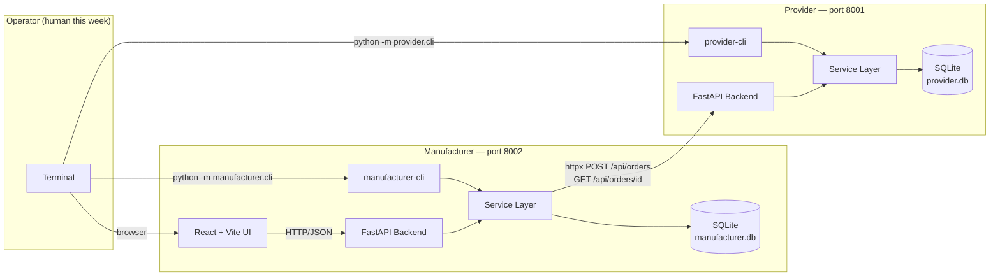
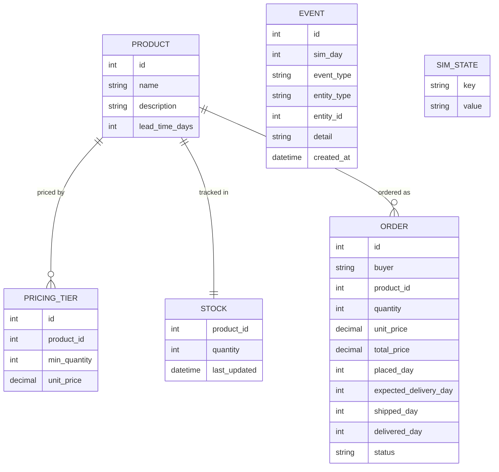

# Week 6 Report
# 3D Printer Production Simulator — The Supply Chain (Part 1)

## Team

- Pol Plana
- Alba Roma
- Emma Nájera

## 1. Architecture

### 1.1 From one app to two

Week 5 delivered a single process: a React + Vite frontend, a FastAPI backend, and one SQLite database. Week 6 introduced a second, fully independent process — the **provider** — that sells raw materials to the manufacturer over HTTP. The two apps share no code, no database, and no Python imports across the boundary. All communication flows through a documented REST contract.

The manufacturer kept its port-8002 backend and React dashboard unchanged from the user's perspective. What changed internally: the manufacturer now also acts as an HTTP client, posting purchase orders to the provider and polling for delivery status on every day advance.



The day-advance protocol is manual this week: the human runs `provider-cli day advance` first, then `manufacturer-cli day advance`. On the manufacturer side, the advance triggers a polling loop over each pending external purchase order. When the provider reports `DELIVERED`, the manufacturer adds the parts to its own inventory in the same database transaction.

### 1.2 Provider data model

The provider's entities are `Product`, `PricingTier`, `Stock`, `Order`, `Event`, and `SimState`. The order lifecycle follows an explicit enum state machine, never scattered booleans:

```
PENDING → CONFIRMED → IN_PROGRESS → SHIPPED → DELIVERED
   ↓
REJECTED (insufficient stock) | CANCELLED (operator action)
```

`SimState` is a key-value table holding `current_day` so it survives process restarts. `Event` is append-only; every state transition writes a row in the same database transaction as the transition itself.



### 1.3 Manufacturer additions (incremental)

The Week 5 `Supplier` table gained two optional columns: `external_provider_url` and `external_product_id`. When both are set, the supplier row represents a real external process rather than an internal stub. The `PurchaseOrder` table gained `external_order_id` to store the ID the provider assigned on order placement.

This design kept the Week 5 React UI, existing manufacturing-order workflow, and all internal purchase-order logic completely intact. An internal supplier simply has null in those columns; all existing code paths treat it exactly as before.

## 2. The REST Contract

### 2.1 Provider endpoints

| Method | Path | Purpose |
|--------|------|---------|
| GET | `/api/catalog` | Products with pricing tiers and current stock quantity |
| GET | `/api/stock` | Current inventory per product |
| POST | `/api/orders` | Place a purchase order |
| GET | `/api/orders` | List orders; optional `?status=PENDING` filter |
| GET | `/api/orders/{id}` | Single order with full lifecycle timestamps |
| POST | `/api/day/advance` | Process one simulated day |
| GET | `/api/day/current` | Current simulated day |
| GET | `/health` | Liveness probe |
| GET | `/docs` | Auto-generated Swagger / OpenAPI |

Every response includes a `schema_version: 1` field so breaking changes can be versioned explicitly when the API evolves.

### 2.2 Design decisions and rationale

**Order placement is synchronous.** `POST /api/orders` returns the created order immediately, including the computed `unit_price`, `total_price`, and `expected_delivery_day`. The manufacturer does not need a second call to confirm the order: it already has everything needed to record the purchase order locally.

**Stock is reserved at placement, not at delivery.** The provider decrements stock when it accepts the order. An order for more units than available stock is rejected immediately with a `400` response. This prevents overselling and avoids the complexity of a reservation system — the trade-off is that the manufacturer must handle a rejection response gracefully.

**Day advance is the only write path for status transitions.** No endpoint moves an order manually from `PENDING` to `SHIPPED`. Only `POST /api/day/advance` does that. This guarantees that transitions always carry the correct `sim_day` and that the event row is written atomically with the status change.

**Polling, not webhooks.** The manufacturer polls `GET /api/orders/{id}` on every day advance for each pending external purchase order. This is simpler than a push model for this week's manual scenario. The cost is one HTTP call per outstanding order per day advance, which is acceptable at this scale.

**Pricing is resolved server-side.** When the manufacturer orders 50 units, the provider resolves the applicable tier (for example, ≥20 units → 32 EUR per Control Board) and returns the computed `unit_price`. The manufacturer does not calculate pricing itself. This respects the boundary: pricing belongs to the seller.

## 3. The Five-Day Scenario

### 3.1 Setup

The scenario exercises the Control Board material, which maps directly to the PCB example in the course brief: 3-day lead time, tier-20 unit price of 32 EUR. Starting state: provider has 500 Control Boards; manufacturer has 5; both apps on day 0. The scenario was validated both by running the CLI manually and by the focused smoke test described in section 4.

### 3.2 Day-by-day log

| Day | Actions | Provider | Manufacturer |
|-----|---------|----------|--------------|
| 1 | `purchase create --supplier "ChipSupply Co" --product "Control Board" --qty 50`; advance both | Order `PENDING → SHIPPED`; stock 500 → 450; `expected_delivery_day = 4` | PO recorded with `external_order_id`; polling returns `SHIPPED`; inventory unchanged |
| 2–3 | Advance both apps each day | Order stays `SHIPPED` | Polling returns `SHIPPED`; no inventory change |
| 4 | Advance provider first; advance manufacturer | `SHIPPED → DELIVERED`; `delivered_day = 4` | Polling returns `DELIVERED`; PO marked `DELIVERED`; inventory += 50 → **55 Control Boards** |
| 5 | Place second order (30 units); advance both | New order: `PENDING → SHIPPED`; `expected_delivery_day = 8` | PO recorded; second cross-app lifecycle begins |

### 3.3 Event log coherence

The two audit trails tell the same story from their respective perspectives.

Provider events for order #1:
`ORDER_PLACED (day 1) → ORDER_CONFIRMED (day 1) → ORDER_IN_PROGRESS (day 1) → ORDER_SHIPPED (day 1) → ORDER_DELIVERED (day 4)`

Manufacturer events for the same purchase order:
`PO_CREATED (day 1, external_order_id recorded) → PO_DELIVERED (day 4, quantity=50 added to inventory)`

### 3.4 What surprised us

**Day-advance ordering is stricter than it appears.** If the manufacturer advances before the provider on day 4, the polling call sees the order still in `SHIPPED` state, and the delivery is deferred by a full simulated day. The rule — provider first, manufacturer second — must be followed consistently every day. This is a fragility the Week 7 turn engine will resolve automatically.

**The collapsed transition sequence.** During day-advance, the provider walks an order through `PENDING → CONFIRMED → IN_PROGRESS → SHIPPED` in a single tick and logs each transition as a separate event row. This means the order can go from placed to shipped in one call. We expected to see `CONFIRMED` and `IN_PROGRESS` as stable overnight states, but the brief allowed collapsing intermediate states while keeping the event rows. In retrospect it makes sense for this simulation cadence, but it was surprising the first time we read the event log and saw four transitions on the same day.

## 4. Testing

### 4.1 Provider tests (27 tests across 7 files)

| File | Coverage |
|------|---------|
| `test_pricing.py` | Tier calculation at all quantity boundaries |
| `test_order_service.py` | Stock depletion at placement; rejection on insufficient stock; delivery-day math |
| `test_day_service.py` | State transitions per day-tick; event rows written; delivery timing |
| `test_api_routes.py` | Endpoint contracts: status codes, response schema, `schema_version` field |
| `test_models_seed.py` | Seed loading and validation; lead-time enforcement |
| `test_five_day_scenario.py` | End-to-end: place order, advance days, verify inventory at each step |

### 4.2 Manufacturer smoke test

The key test in `manufacturer/backend/tests/test_operations_flow.py` is `test_external_provider_purchase_order_delivers_after_provider_poll`. It uses `httpx.MockTransport` to simulate provider responses without starting a real provider process. The mock returns `SHIPPED` on polls for days 2 and 3 and `DELIVERED` on day 4. Assertions:

- Manufacturer PO status is `DELIVERED` after day 4 advance
- Inventory increased from 5 to 55 Control Boards
- HTTP request log matches exactly: one `POST /api/orders` followed by three `GET /api/orders/17` calls

This test is the regression gate for the cross-app handoff.

### 4.3 Totals

42 tests pass across both suites. `ruff` reports zero warnings. `mypy --strict` passes on both apps' service layers and models. The legacy `dashboard.py` and Week 5 untyped API route handlers are excluded from strict checking — annotating them is a follow-up pass.

## 5. Vibe Coding Reflection

### 5.1 What Claude Code did well

Claude Code handled structural work cleanly when given precise scope. The provider data model, service layer, and FastAPI routes were generated with correct SQLAlchemy 2.0 `Mapped[]` style, proper Pydantic schemas, and the thin-wrapper pattern throughout: routes call services, no business logic in route handlers. The five-day smoke test using `httpx.MockTransport` was also generated correctly, including the mock transport handler that returns a status sequence.

The `CLAUDE.md` contract file served as intended. Because every session started by reading `CLAUDE.md` and `docs/PRD-week6.md`, the agent did not re-derive the architecture from scratch, did not suggest Streamlit or SimPy, and did not invent endpoint shapes that contradicted the documented contract.

### 5.2 Where it needed correction

<!-- ============================================================
     TEAM: this section has two options. Pick one, delete the other.

     OPTION A — specific examples (inferred from the code, not
     directly observed during the session — verify before keeping):
     ============================================================ -->

<!--
**Silent error swallowing.** In an early version, the manufacturer's `process_deliveries()` silently caught `httpx` exceptions and continued as if no delivery had occurred. This violated the PRD rule ("never silently swallow the failure") and had to be corrected explicitly: the function must re-raise or surface the error so the operator sees it.

**Business logic drifting into routes.** The first-pass route handlers occasionally contained inline pricing or status-transition logic instead of delegating to the service layer. Since both the CLI and the REST API must call the same services, any logic in a route handler cannot be reused by the CLI. These occurrences had to be moved manually.

**Type annotation gaps.** Early generated code used bare `dict` return types where typed `Pydantic` response models were required, and unqualified `Optional` where `Optional[str]` was needed. `mypy --strict` caught all of these, but they required a cleanup pass before the type checks turned green.
-->

<!-- ============================================================
     OPTION B — higher level, no specific claims (safe default
     if you don't remember the exact corrections):
     ============================================================ -->

The corrections we had to make fell into two categories. The first was boundary enforcement: generated code occasionally placed logic in the wrong layer (route handlers instead of services) or handled errors too permissively. The second was type-annotation completeness: `mypy --strict` caught several return types that were too broad and required a dedicated cleanup pass before the checks turned green. In both cases, having the PRD and `CLAUDE.md` as reference made it straightforward to decide whether a generated piece of code was wrong — it either followed the documented rules or it did not.

<!-- ============================================================
     END OF OPTIONS — replace this block with whichever you chose
     ============================================================ -->

### 5.3 Prompting observations

The same lesson from Week 5 held for Week 6. The most reliable prompt shape was:

> Read `CLAUDE.md` and `docs/PRD-week6.md §5.3`. In `provider/app/services/day_service.py`, implement `advance()` so that it (1) delivers shipped orders whose `expected_delivery_day == current_day`, (2) walks pending orders with stock through `PENDING → CONFIRMED → IN_PROGRESS → SHIPPED`, (3) increments `current_day`, and (4) writes one event row per transition plus a `DAY_ADVANCED` summary row. Write the corresponding tests in `provider/tests/test_day_service.py`.

Providing the file path, the function name, the numbered spec from the PRD, and the test file location together eliminated almost all ambiguity. Prompts that left any of those details out produced code that required more corrections.

### 5.4 Did the PRD-first approach help?

More visibly than in Week 5. With two applications and a cross-app protocol, the risk of architectural drift between sessions is higher. The PRD's cross-app contract section (§7 of `PRD-week6.md`) became the reliable tie-breaker for design questions that came up mid-implementation: who owns pricing resolution? the provider. Who owns each day counter? each app independently. Who retries on error? nobody — surface it. Without those decisions written down, the coding agent would have had to invent answers, and those inventions would have been inconsistent across sessions.

The PRD was also the right place to record what changed from the brief's suggestions and why — the port move from 8000 to 8002, the collapsed intermediate order states, the polling design over webhooks. Having those decisions written down meant we never re-debated them, and the agent never accidentally undid a choice that had been made deliberately.

Development followed the milestones in order — data model, then services, then routes and CLIs, then cross-app integration, then a dedicated pass for `mypy --strict` and `ruff` cleanup. Keeping tooling hardening as a separate final step, rather than mixing it into feature work, made each milestone easier to review and reduced the risk of a linting fix accidentally changing behavior.
