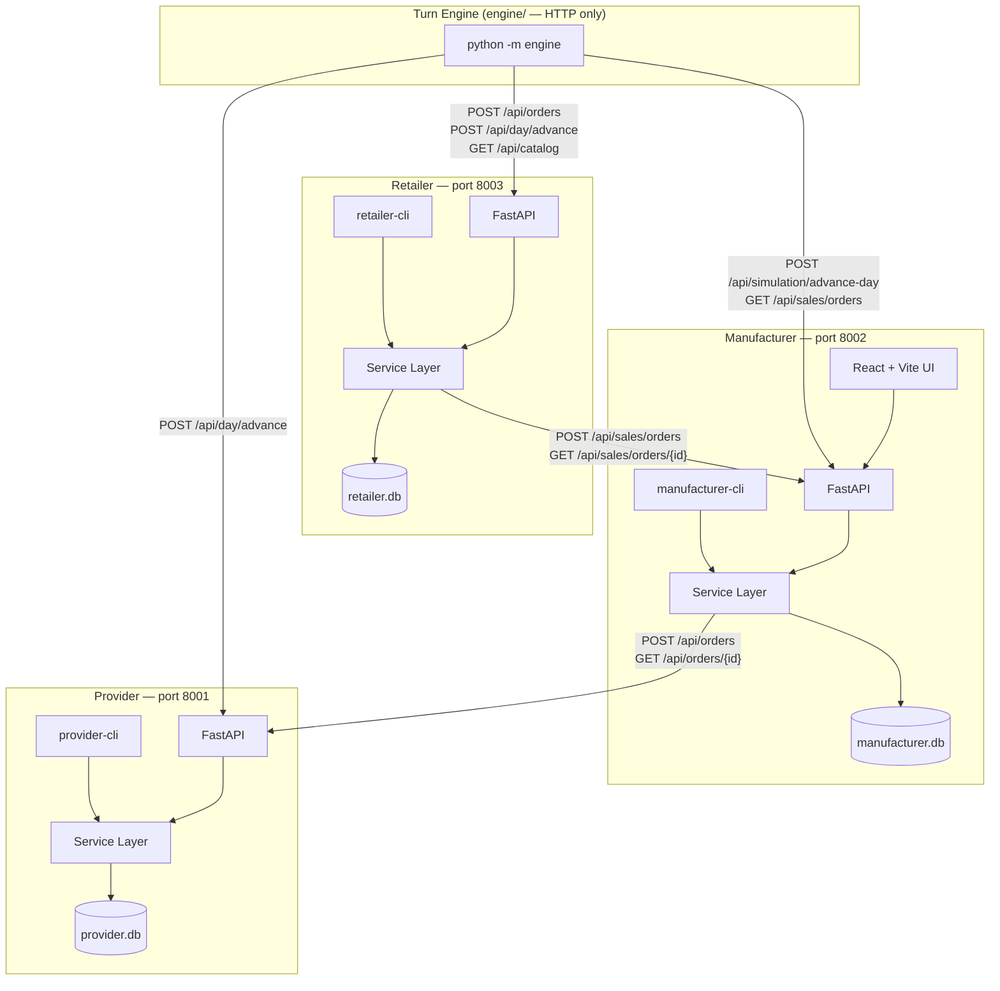
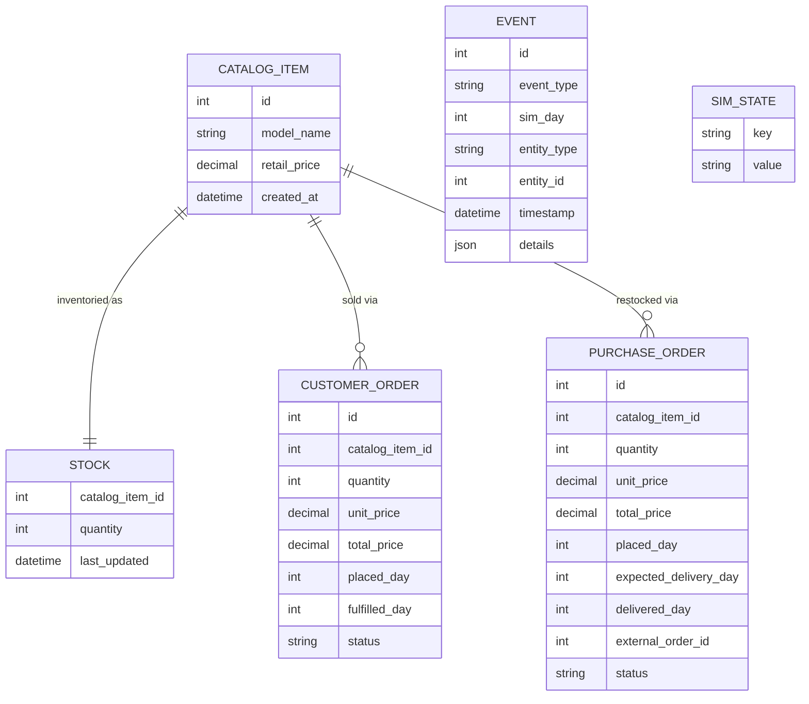
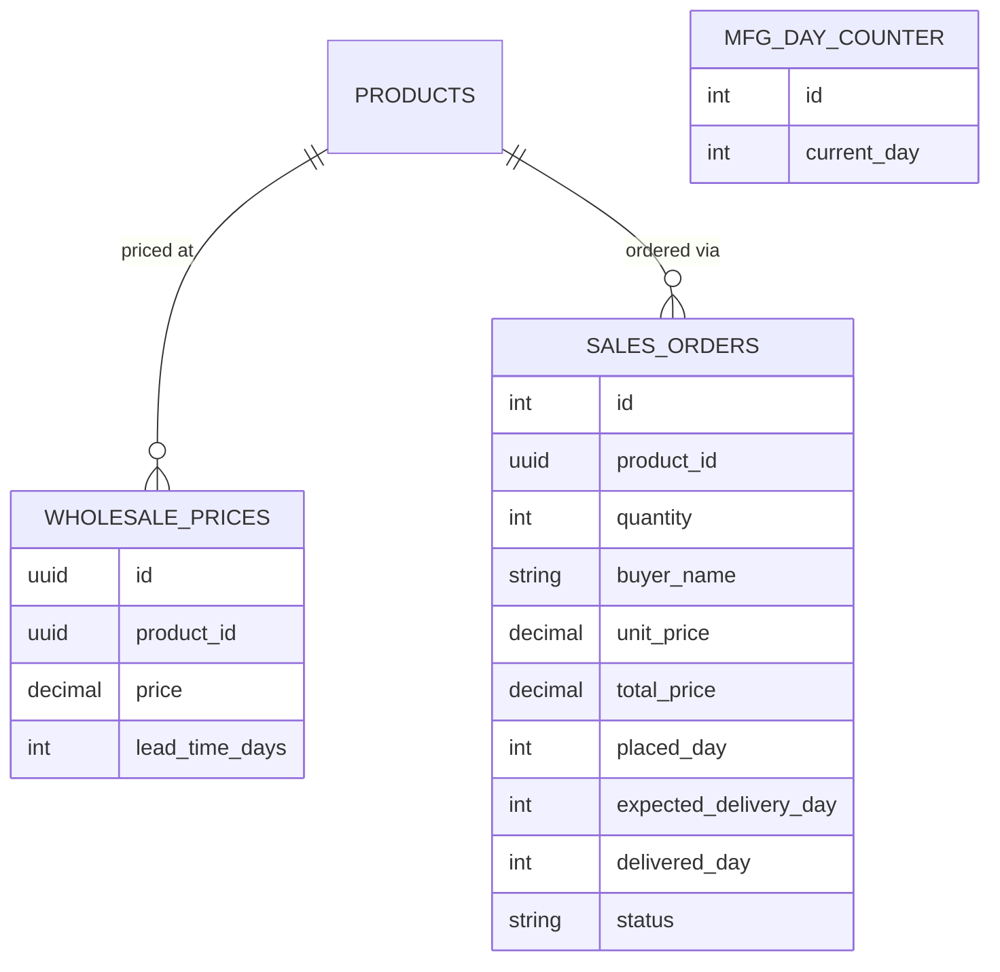

# Week 7 Report
# 3D Printer Production Simulator — The Full Supply Chain

## Team

- Pol Plana
- Alba Roma
- Emma Nájera

---

## 1. Architecture

### 1.1 From two apps to three, plus a turn engine

Week 6 delivered two cooperating processes: a provider that sells raw materials and a manufacturer that buys them. Week 7 completes the chain by adding a **retailer** that buys finished printers from the manufacturer and sells them to end customers. A **turn engine** (`engine/` package) ties the three apps together, advancing them in lockstep each simulated day.

All three apps share the same architectural rules established in Week 6: one SQLite database each, all cross-app communication over HTTP/JSON, no shared Python imports across process boundaries. The retailer is multi-instance capable — port, database path, and manufacturer URL all come from a config file rather than module-level constants.



### 1.2 Retailer data model

The retailer's entities follow the same conventions as the provider — integer primary keys, enum-backed status fields, an append-only event table, and a `SimState` key-value store for `current_day`.



Customer order lifecycle:

```
pending → fulfilled
   ↓
backordered → fulfilled   (auto-fulfilled on stock arrival)
   ↓
cancelled
```

When a delivery arrives from the manufacturer, the retailer auto-fulfils backordered orders in FIFO order, consuming stock until either all backorders are cleared or stock is exhausted. This happens atomically in the same transaction as the stock credit.

### 1.3 Manufacturer additions (Week 7)

Two new tables: `WholesalePrice` (one row per printer model, holding the price and lead time the retailer sees) and `SalesOrder` (inbound orders from retailers). A third table, `MfgDayCounter`, holds an integer day counter that is independent of the manufacturer's existing `SimulationConfig.sim_date` — it advances in lockstep with the retailer and provider day counters, while `sim_date` continues to track the simulation's calendar date.



Sales order lifecycle:

```
pending → delivered
   ↓
cancelled
```

The lifecycle is intentionally simpler than the provider's five-state lifecycle. The manufacturer does not attempt to model production capacity constraints on sales orders at this stage: a sales order placed on day N is guaranteed delivered on day `N + lead_time_days`, regardless of internal capacity. Connecting sales order delivery to real production capacity is deferred to Week 8.

---

## 2. The REST Contract Additions (Week 7)

### 2.1 Manufacturer — new sales endpoints

| Method | Path | Purpose |
|--------|------|---------|
| POST | `/api/sales/orders` | Retailer places a purchase order for finished printers |
| GET | `/api/sales/orders` | List all sales orders |
| GET | `/api/sales/orders/{id}` | Single sales order — retailer polls this |
| GET | `/api/sales/prices` | Wholesale prices per model |
| PUT | `/api/sales/prices/{model}` | Update wholesale price and lead time for a model |

`POST /api/sales/orders` request body:

```json
{ "model_name": "Basic300", "quantity": 5, "buyer_name": "PrinterWorld" }
```

Response includes `unit_price`, `total_price`, `placed_day`, `expected_delivery_day`, and `status`.

### 2.2 Retailer endpoints

| Method | Path | Purpose |
|--------|------|---------|
| GET | `/api/catalog` | Printer models with retail prices |
| GET | `/api/stock` | Current finished-printer inventory |
| POST | `/api/orders` | End customer places an order |
| GET | `/api/orders` | List customer orders; optional `?status=` filter |
| GET | `/api/orders/{id}` | Single customer order with lifecycle timestamps |
| POST | `/api/purchases` | Retailer places a purchase order with the manufacturer |
| GET | `/api/purchases` | List purchase orders placed with the manufacturer |
| GET | `/api/purchases/{id}` | Single purchase order with status |
| POST | `/api/day/advance` | Advance simulated day by 1 |
| GET | `/api/day/current` | Current simulated day |
| GET | `/health` | Liveness probe |

### 2.3 Design decisions

**Separate URL prefix for sales.** The manufacturer's existing `POST /api/orders` endpoint handles manufacturing orders from its own internal demand pipeline. Adding `POST /api/sales/orders` for retailer-facing orders avoids a routing collision without restructuring the existing API. The trade-off is a slightly inconsistent URL surface; the benefit is zero risk to the Week 5/6 manufacturing workflow.

**Polling, not push.** The retailer polls `GET /api/sales/orders/{id}` on every day advance for each in-flight purchase order, mirroring exactly the pattern the manufacturer uses against the provider. Consistency across all three hops simplifies the turn engine: it does not need to manage webhooks or callbacks.

**Wholesale prices seeded at bootstrap.** `bootstrap_database()` calls `SalesService.seed_default_prices()`, which creates default wholesale prices for all known printer models if none exist. This is idempotent and means a freshly cloned repository can be seeded and run without a manual price-configuration step. Operators who want different prices use `manufacturer-cli price set`.

---

## 3. Turn Engine Design

### 3.1 Overview

*(M4 not yet implemented — this section describes the planned design.)*

The turn engine is a headless Python package at `engine/`. It has no SQLAlchemy dependency and imports nothing from any of the three app packages. All state access goes through HTTP.

```bash
python -m engine \
    --scenario engine/scenarios/week7-default.json \
    --days 5 \
    --seed 42 \
    --log-dir logs/
```

Each day, the engine: reads the scenario's signals, fetches retailer prices, generates customer demand, runs each agent's decision logic, advances all three apps in the correct order, then appends a KPI row.

### 3.2 Day-advance order and rationale

The engine advances the three apps in the order **retailer → manufacturer → provider**.

This is the reverse of the Week 6 manual convention (where the provider advanced first). The reasoning is the same in both directions: whichever app is polled must be in its final state for the current day before the poller advances.

Under the engine:

1. **Retailer advances first.** Its day advance polls the manufacturer for sales-order deliveries. The manufacturer's state for the current day is already settled — it was advanced in the previous cycle.
2. **Manufacturer advances second.** Its day advance polls the provider for raw-material deliveries. The provider's state for the current day is already settled.
3. **Provider advances last.** It moves its own orders through `in_progress → shipped → delivered`. These transitions are not yet visible to the manufacturer; they will be visible on the next cycle.

The key invariant: the entity being polled always reflects the completed day before the poller advances. This keeps the ironclad lead-time rule intact at all three hops — no delivery is ever credited the same tick it transitions to `delivered`.

The Week 6 manual order (provider → manufacturer) also satisfied this invariant, just from the other side of the same reasoning. The engine's order reversal was intentional: when advancing downstream first, each app's day advance polls a fully-updated upstream. Both orderings are consistent with the protocol; the engine's ordering is better suited to automation because it requires no coordination between operators.

### 3.3 Customer demand generation

```python
def generate_customer_demand(
    day: int,
    signal: dict,
    retailer_prices: dict[str, float],
    base_price: float,
    rng: random.Random,
) -> list[tuple[str, int]]:
    base = signal.get("base_demand", {"mean": 5, "variance": 2})
    modifier = signal.get("demand_modifier", 1.0)
    orders: list[tuple[str, int]] = []
    for model, price in retailer_prices.items():
        mean_orders = base["mean"] * modifier
        price_factor = max(0.2, 1.0 - (price - base_price) / base_price)
        adjusted_mean = mean_orders * price_factor
        n = max(0, int(rng.gauss(adjusted_mean, base["variance"])))
        orders.extend([(model, 1)] * n)
    return orders
```

The `price_factor` term implements a simple demand elasticity: a retailer priced well above `base_price` sees proportionally fewer orders. The `max(0.2, ...)` floor prevents demand from collapsing to zero even at very high prices. The `rng` is seeded from `--seed` so scenarios are reproducible.

### 3.4 KPI log

After each day advance, the engine appends one row to `logs/kpi.csv`:

| Column | Source |
|--------|--------|
| `day` | Engine counter |
| `retailer_stock_total` | Sum of `GET /api/stock` |
| `retailer_pending_orders` | `GET /api/orders?status=PENDING` count |
| `retailer_backordered` | `GET /api/orders?status=BACKORDERED` count |
| `manufacturer_pending_sales` | Count of pending sales orders |
| `provider_stock_control_board` | `GET /api/stock` on provider |
| `demand_modifier` | From scenario file |

---

## 4. Skill File — Manufacturer Manager

*(M5 not yet implemented — the skill file will be authored after M4 is validated. The section below describes its planned content and the two key design decisions that will shape it.)*

### 4.1 Location and purpose

`skills/manufacturer-manager.md` is a structured Markdown prompt loaded by the turn engine and passed verbatim to `claude --print` at runtime. It is not executable itself. The file is versioned (`## Version: v1.0 — Week 7`) so breaking changes — new commands, revised decision logic — are traceable in git history.

### 4.2 Content (planned)

The file will contain five required sections:

**`## Your Role`** — one paragraph situating the agent in the supply chain: buys raw materials from the provider, converts them to finished printers, sells wholesale to the retailer at configurable prices.

**`## Available Commands`** — exhaustive CLI command list grouped by concern (read-only, purchasing, production release, pricing). Commands the agent must not call (`day advance`, any retailer or provider command) are listed explicitly under `## DO NOT`.

**`## Decision Framework`** — a numbered, day-by-day procedure:

1. **Assess.** Run read-only commands; summarise state in 2–3 sentences.
2. **Fulfil.** Release pending sales orders where parts are in stock and capacity is available. Prioritise oldest first.
3. **Replenish.** For each material below two days of expected consumption, check the supplier catalog and place the best purchase order. Justify the supplier choice in one sentence.
4. **Price.** If orders exceed capacity by >50% for two consecutive days, raise wholesale prices 5–10%. If utilisation <40% for two days, lower them 5–10%. Floor: cost + 15% margin.
5. **Log.** Print one human-readable line before each mutating command.

**`## Market Signals`** — interpretation rules for `demand_modifier` and `supply_modifier` values injected by the engine into the prompt.

**`## When Done`** — the agent prints a 3–5 bullet summary then exits. It never calls `day advance`.

### 4.3 Two design decisions

**Decision 1: explicit "DO NOT" list rather than capability restriction.**
An earlier approach considered whitelisting commands — only the commands on the allowed list would be executed. Instead, the skill file names forbidden actions explicitly and the engine validates parsed output before executing any command. The reason: a whitelist silently ignores any command not on it, making it hard to notice when the agent tries something unexpected. An explicit prohibition list plus a validation step makes violations visible and catchable.

**Decision 2: require reasoning before every mutating action.**
The framework requires the agent to print one log line before each `manufacturer-cli` command that writes state (`purchase create`, `price set`, release). This was not included in the original PRD spec and was added for two reasons: it makes the agent's transcript useful as an audit trail for the PoC run, and it gives the LLM a structured slot to externalise its reasoning before acting, which generally improves decision quality in tool-use settings.

---

## 5. Proof-of-Concept Run

*(To be completed after M5 is implemented. This section will contain:)*

- *The exact invocation used.*
- *Excerpts from `logs/manufacturer-agent-day-*.txt`.*
- *Commentary on two or three specific decisions the agent made — what it got right and where it was shaky.*
- *KPI CSV output for the 5-day run.*

---

## 6. Testing

### 6.1 Retailer tests (3 tests)

| Test | What it verifies |
|------|-----------------|
| `test_customer_order_fulfilled_from_stock` | Order placed when stock ≥ quantity → status `FULFILLED`, stock decremented |
| `test_customer_order_backordered_when_no_stock` | Order placed when stock = 0 → status `BACKORDERED`, no stock change |
| `test_day_advance_fulfills_backorder_after_delivery` | Backordered order auto-fulfils when manufacturer reports `DELIVERED`; uses `httpx.MockTransport` |

### 6.2 Manufacturer sales tests (8 tests)

| Test | What it verifies |
|------|-----------------|
| `test_create_sales_order_sets_expected_delivery_day` | `placed_day + lead_time_days = expected_delivery_day` |
| `test_sales_order_delivered_after_enough_day_advances` | After N advances, PENDING → DELIVERED |
| `test_sales_order_not_delivered_before_lead_time` | Order stays PENDING until lead time elapses |
| `test_post_sales_order_returns_201` | HTTP route: correct status code and response body |
| `test_get_sales_order_returns_200` | HTTP route: polling endpoint returns persisted order |
| `test_get_nonexistent_sales_order_returns_404` | HTTP route: 404 on unknown ID |
| `test_list_wholesale_prices` | Seeded prices appear in the list endpoint |
| `test_set_wholesale_price` | Price and lead time update via PUT route |

### 6.3 Totals

53 tests pass across all three apps. `mypy --strict` passes on the retailer package (27 source files) and on the new manufacturer sales service and route. `ruff` reports zero warnings across the whole repository.

---

## 7. Vibe Coding Reflection

### 7.1 What Claude Code (the builder) did well

**Structural scaffolding across three apps.** The service-layer pattern — thin routes, thick services, CLI as a second consumer of the same services — was correctly reproduced for the retailer without any explicit instruction. The ninth service file (`admin_service.py`, for export/import) followed exactly the same conventions as the first.

**Cross-app test isolation.** The `httpx.MockTransport` pattern used in the manufacturer tests (Week 6) was correctly reapplied to the retailer's day-advance test without prompting. The test injects a mock that returns `DELIVERED` for a specific order ID, verifying the full backorder-resolution chain without a live manufacturer process.

**SQLAlchemy 2.0 consistency.** All new retailer and manufacturer models used the `Mapped[]` / `mapped_column()` style throughout. No legacy `Column()` calls were introduced.

**`CLAUDE.md` as a session anchor.** Because the file names the exact mypy invocation for each app, the type-checking conventions were never re-derived. The retailer package was mypy-strict-clean from its first commit.

### 7.2 Where Claude Code needed correction

**Model name mismatch across apps (caught by the user).** The retailer seed file was written with model names "P3D Classic", "P3D Pro", and "P3D Mini" — names invented when drafting the PRD before the manufacturer's code had been read. The manufacturer's starter profile uses "Basic300", "Pro450", and "Elite700". The two apps were internally self-consistent but incompatible at the boundary. The user caught this during the M3 verification pass. The fix was a one-line seed file update, but the root cause is a repeatable failure mode: when generating both sides of a cross-app contract in separate sessions, Claude Code does not automatically verify that names agree across the boundary.

**API field name mismatch between the two implementations (caught during M3 development).** The retailer's `purchase_service.py` was written first, following the PRD's sample JSON body (`{"buyer": ..., "model": ...}`). The manufacturer's `SalesOrderCreate` schema was written separately and used Pydantic naming conventions (`{"buyer_name": ..., "model_name": ...}`). Both sides were individually correct and internally consistent; neither matched the other. The field names were corrected when the two files were first read together.

**Schema gap in the API response (caught during verification).** The manufacturer's `advance_day()` service method was extended to return a `sales_orders_delivered` count, and the internal dict included it. The `DayAdvanceResult` Pydantic response schema was not updated to match, so the field was silently stripped from API responses. The API continued to function — the missing field only became apparent when verifying the KPI output during M3 testing.

**EventType enum drift (caught during end-to-end testing).** When M3 added `SALES_ORDER_PLACED`, `SALES_ORDER_DELIVERED`, and `WHOLESALE_PRICE_CHANGED` to the SQLAlchemy `EventType` enum in `models.py`, the matching Pydantic `EventType` enum in `schemas.py` was not updated. Events were written to the database correctly, but when the `/api/events` route tried to serialize them, FastAPI's response validation rejected the unknown values and returned a 500. The React UI caught this as "Failed to load the overview dashboard" — a misleading symptom that gave no indication of where the real failure was. The bug was silent during all writes and only surfaced at the first read, which is why it was missed by unit tests. The fix was adding four lines to `schemas.py`.

**Working-directory / database-path mismatch (caught during a full reset).** Each server resolves its SQLite path relative to its working directory (`sqlite:///./printer_factory_sim.db`). When the manufacturer seed script was run from the repository root instead of `manufacturer/backend/`, it wrote to a different file than the server was reading. The script exited with a success message, the data appeared to load, and the server continued running against an empty database. No error was raised anywhere. The same problem affected the provider and retailer seed scripts. The fix is always to run seed scripts from the app's own directory. The deeper issue is that success at the script level gave no signal that anything was wrong — the failure was only visible at the API level when the returned data was empty.

The pattern across all five issues is the same: Claude Code generates code that is coherent within each file but does not automatically cross-check contracts at boundaries — between apps, between a service dict and its Pydantic response model, between a PRD example and the actual implementation, between two enum definitions representing the same domain concept, or between a script's working directory and the server's expected file location.

### 7.3 What the manufacturer-manager agent did well and poorly

*(To be completed after the M5 proof-of-concept run.)*

### 7.4 Prompting observations

The most effective prompt shape for Week 7 was unchanged from Week 6:

> Read `CLAUDE.md` and `docs/PRD-week7.md §4.4`. In `retailer/app/services/day_service.py`, implement `advance()` so that it (1) polls the manufacturer for each pending purchase order, (2) credits stock for each `DELIVERED` order, (3) auto-fulfils backordered customer orders in FIFO order, (4) increments `current_day`, and (5) writes one `DAY_ADVANCED` event row. Write the corresponding test in `retailer/tests/test_order_service.py` using `httpx.MockTransport`.

File path + function name + numbered spec from the PRD + test location — that combination eliminated nearly all ambiguity. The one prompt pattern that reliably caused problems was omitting the cross-app field names: asking for "a service that POSTs to the manufacturer" without specifying the exact JSON body led to a field-name mismatch that had to be corrected manually.

### 7.5 Did the PRD-first approach help?

More than in Week 6. With three apps and a turn engine, the number of cross-app contracts is higher and the risk of architectural drift between sessions grows. The PRD's explicit decisions — which URL prefix for the new sales API, the advance order and its rationale, the multi-instance retailer design, the integer day counter separate from the existing `sim_date` — served as tie-breakers throughout. Without them, each session would have had to re-derive those answers, and the answers would likely have been inconsistent.

The advance-order decision (§3.2 above) is the clearest example. Both the Week 6 convention (provider first) and the Week 7 engine convention (retailer first) are consistent with the same underlying invariant. Without the PRD recording the Week 7 choice explicitly, Claude Code would have defaulted to the Week 6 order — which is wrong for the engine because it would credit deliveries one tick late.
