# Week 8 Report — The Supply Chain (Part 3): Autonomy and Analysis
# 3D Printer Production Simulator

**Team:** Pol Plana · Alba Roma · Emma Nájera

---

## a) System Architecture

### Full System

The completed system consists of three independent services — provider, manufacturer, and retailer — plus a turn engine that orchestrates them through simulated time. Each service owns its own SQLite database and its own day counter. No service reads another's database. All cross-service communication goes through HTTP/JSON over documented REST contracts.

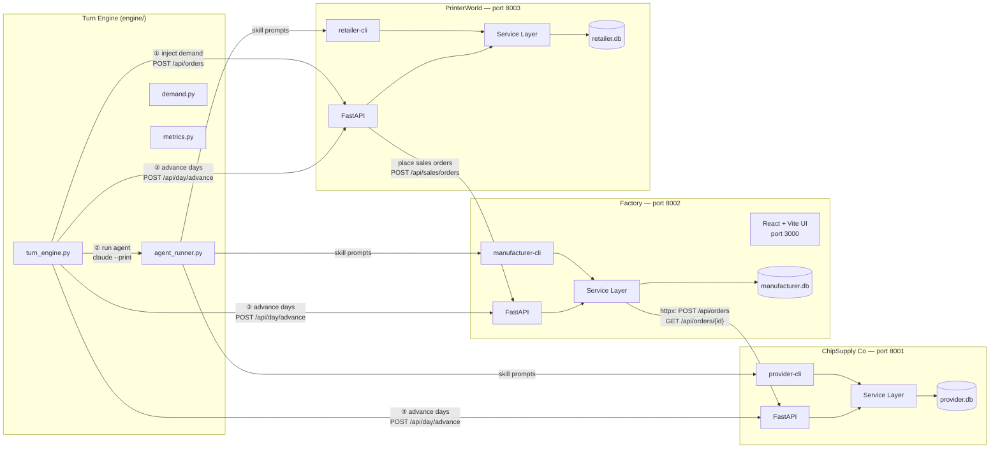
```mermaid
flowchart LR
    subgraph Engine["Turn Engine (engine/)"]
        TE[turn_engine.py]
        AG[agent_runner.py]
        DM[demand.py]
        ME[metrics.py]
    end

    subgraph Provider["ChipSupply Co — port 8001"]
        PAPI[FastAPI]
        PSVC[Service Layer]
        PDB[(provider.db)]
        PCLI[provider-cli]
    end

    subgraph Manufacturer["Factory — port 8002"]
        MUI[React + Vite UI\nport 3000]
        MAPI[FastAPI]
        MSVC[Service Layer]
        MDB[(manufacturer.db)]
        MCLI[manufacturer-cli]
    end

    subgraph Retailer["PrinterWorld — port 8003"]
        RAPI[FastAPI]
        RSVC[Service Layer]
        RDB[(retailer.db)]
        RCLI[retailer-cli]
    end

    TE -->|"① inject demand\nPOST /api/orders"| RAPI
    TE -->|"② run agent\nclaude --print"| AG
    AG -->|skill prompts| RCLI
    AG -->|skill prompts| MCLI
    AG -->|skill prompts| PCLI
    TE -->|"③ advance days\nPOST /api/day/advance"| RAPI
    TE -->|"③ advance days\nPOST /api/day/advance"| MAPI
    TE -->|"③ advance days\nPOST /api/day/advance"| PAPI

    RCLI --> RSVC --> RDB
    MCLI --> MSVC --> MDB
    PCLI --> PSVC --> PDB
    RAPI --> RSVC
    MAPI --> MSVC
    PAPI --> PSVC

    MSVC -->|"httpx: POST /api/orders\nGET /api/orders/{id}"| PAPI
    RAPI -->|"place sales orders\nPOST /api/sales/orders"| MAPI
```

### Turn Engine — Order of Operations

Each simulated day runs in five phases:

1. **Signal injection.** The engine reads the active scenario event for the current day and applies the `supply_modifier` and `lead_time_modifier` to the provider's stock replenishment settings.
2. **Demand injection.** The engine generates synthetic customer orders from a Gaussian distribution scaled by `demand_modifier` and `base_demand`, then posts them to the retailer's `/api/orders` endpoint. The demand formula is `round(N(mean × demand_modifier, variance))` orders placed.
3. **Agent turns (sequential).** Each agent receives a pre-fetched state snapshot and a copy of the active market signal in its prompt. Execution order is **retailer → manufacturer → provider**. The retailer acts first because it places sales orders on the manufacturer; the manufacturer's state is re-fetched after the retailer turn so it sees those orders before it decides. The provider acts last because its stock levels do not affect manufacturer decisions within the same tick.
4. **Day advance.** All three apps advance their internal day counters in the same order: retailer → manufacturer → provider. The manufacturer's advance polls every pending external purchase order against the provider and delivers inventory when the provider reports `DELIVERED`.
5. **Metrics snapshot.** The engine queries each app's REST surface and appends a JSON line to `logs/metrics.jsonl` capturing stock, prices, order counts, and financials for that day.

### How Market Signals Flow

The scenario file defines events with start/end days and multipliers. The engine resolves which events overlap for a given day and computes the effective modifiers (overlapping `demand_modifier` values are multiplied; `supply_modifier` and `lead_time_modifier` take the minimum, i.e. the most constrained value). The resulting signal is:

- **Passed verbatim in the agent prompt.** Each skill file receives the signal as structured text: `demand_modifier`, `supply_modifier`, `active_events`, and `event_descriptions`. The agent is expected to read this and adjust its decisions accordingly — order more, raise prices, hold stock.
- **Applied by the engine to provider behaviour.** `supply_modifier` scales the provider's effective restocking. `lead_time_modifier` is shown in the provider's prompt to help the provider agent reason about longer lead times.
- **Applied to demand generation.** `demand_modifier` scales the Gaussian mean before injecting customer orders.

The signal is a hint, not a constraint. Agents may ignore it, act on it, or misread it. That gap between signal and behaviour is where the interesting dynamics come from.

---

### Web UI (Manufacturer Dashboard)

The manufacturer exposes a React + Vite dashboard at `http://localhost:3000` that gives a human operator full visibility into the simulation state without touching the CLI or the database directly.

**Orders**: lists all incoming sales orders from the retailer with their status (PENDING, IN\_PROGRESS, SHIPPED, DELIVERED). The operator can see at a glance how many orders are queued and whether the production pipeline is moving.

**Production**: shows the assembly queue: active manufacturing orders, queued assembly hours, daily capacity, and the number of workers and lines. This is the page where the agent's release decisions are most visible.

**Inventory**: displays current stock for all six raw materials alongside their floor targets and the "trashable" surplus. Colour-coded status flags (CRITICAL, FLOOR, EXCESS) mirror the flags the agent reads from the CLI.

**Suppliers**: lists all six suppliers with their lead times and external provider wiring. Shows pending purchase orders in transit and their expected delivery days.

**Retailers**: shows the connected retailer (PrinterWorld), the sales orders it has placed, and delivery status. This is the manufacturer's view of its downstream customer.

**Financials**: running totals for revenue, material costs, labour costs, and net profit. Updated each simulated day so the operator can track whether the agent's pricing decisions are generating margin.

**Reports**: per-day event log and summary statistics. The event table is the audit trail: every state transition (order released, delivery received, price changed) is recorded here.

**Scenarios**: the UI launcher for the turn engine. Lets the operator select a config and scenario file, start or stop a multi-day run, and tail the per-turn agent logs in the browser without opening a terminal.

**Settings**: simulation configuration: warehouse capacity, assembly line costs, worker wage rates, and the internal demand generator toggle. Changes here take effect on the next simulated day.

---

### Data Models

#### Provider (ChipSupply Co)

```mermaid
erDiagram
    PRODUCT ||--o{ PRICING_TIER : "priced by"
    PRODUCT ||--|| STOCK : "tracked in"
    PRODUCT ||--o{ ORDER : "ordered as"
    PRODUCT ||--o{ EVENT : "referenced in"

    PRODUCT {
        int id PK
        string name
        string description
        int lead_time_days
    }
    PRICING_TIER {
        int id PK
        int product_id FK
        int min_quantity
        decimal unit_price
    }
    STOCK {
        int product_id PK_FK
        int quantity
        datetime last_updated
    }
    ORDER {
        int id PK
        string buyer
        int product_id FK
        int quantity
        decimal unit_price
        decimal total_price
        int placed_day
        int expected_delivery_day
        int shipped_day
        int delivered_day
        string status
    }
    EVENT {
        int id PK
        int sim_day
        string event_type
        string entity_type
        int entity_id
        string detail
        datetime created_at
    }
    SIM_STATE {
        string key PK
        string value
    }
```

Order lifecycle: `PENDING → CONFIRMED → IN_PROGRESS → SHIPPED → DELIVERED`, with terminal states `REJECTED` (insufficient stock) and `CANCELLED`. When an order is placed, the stock is immediately locked so the same units cannot be sold twice. The lock happens at the moment of ordering, not at the moment the buyer receives the goods. Every time an order moves from one state to the next, a record is written to the event log in the same operation, so the audit trail can never be out of sync with the order state.

#### Manufacturer (Factory)

```mermaid
erDiagram
    PRODUCT ||--o{ BILL_OF_MATERIALS : "made from"
    PRODUCT ||--o{ INVENTORY : "stocked as"
    PRODUCT ||--o{ MANUFACTURING_ORDER : "produced in"
    SUPPLIER ||--o{ PURCHASE_ORDER : "fulfils"
    PRODUCT ||--o{ PURCHASE_ORDER : "sourced as"
    PRODUCT ||--o{ SALES_ORDER : "sold as"

    PRODUCT {
        uuid id PK
        string name
        string type
        float assembly_hours
    }
    BILL_OF_MATERIALS {
        uuid id PK
        uuid finished_product_id FK
        uuid material_id FK
        float quantity_per_unit
    }
    SUPPLIER {
        uuid id PK
        string name
        uuid product_id FK
        decimal unit_cost
        int lead_time_days
        string external_provider_url
        string external_product_id
    }
    INVENTORY {
        uuid product_id PK_FK
        int quantity
        datetime last_updated
    }
    MANUFACTURING_ORDER {
        uuid id PK
        string reference_code
        uuid product_id FK
        int quantity
        string status
        int sim_day
    }
    PURCHASE_ORDER {
        uuid id PK
        string reference_code
        uuid supplier_id FK
        uuid product_id FK
        int quantity
        string status
        string external_order_id
        int sim_day
    }
    SALES_ORDER {
        uuid id PK
        string reference_code
        string retailer_name
        uuid product_id FK
        int quantity
        decimal unit_price
        string status
        int sim_day
    }
    SIMULATION_CONFIG {
        int id PK
        int sim_date
        int warehouse_capacity
        int assembly_lines
        int workers_per_line
        float shift_hours
    }
```

The `Supplier` table gained `external_provider_url` and `external_product_id` in Week 6. When both are set, the manufacturer posts purchase orders to the provider's REST API instead of fulfilling them internally. `PurchaseOrder.external_order_id` stores the provider-assigned ID for polling.

#### Retailer (PrinterWorld)

```mermaid
erDiagram
    CATALOG_ENTRY ||--|| STOCK : "has stock"
    CATALOG_ENTRY ||--o{ CUSTOMER_ORDER : "ordered as"
    CATALOG_ENTRY ||--o{ PURCHASE_ORDER : "replenished via"

    CATALOG_ENTRY {
        string product_name PK
        string description
        decimal retail_price
        datetime created_at
    }
    STOCK {
        string product_name PK_FK
        int quantity
        datetime last_updated
    }
    CUSTOMER_ORDER {
        int id PK
        string customer
        string product_name FK
        int quantity
        decimal unit_price
        decimal total_price
        int placed_day
        int fulfilled_day
        string status
    }
    PURCHASE_ORDER {
        int id PK
        string product_name FK
        int quantity
        decimal unit_price
        string status
        int placed_day
        int expected_delivery_day
        int delivered_day
        string external_order_id
    }
    EVENT {
        int id PK
        int sim_day
        string event_type
        string detail
        datetime created_at
    }
    SIM_STATE {
        string key PK
        string value
    }
```

Customer order lifecycle: `PENDING → FULFILLED` (immediate, when stock is available) or `PENDING → BACKORDERED → FULFILLED` (when stock is empty). The retailer keys its catalog by model name string, instead of a shared ID, since it does not share the manufacturer's product table, this means that cross-app identity travels as text over HTTP.

---

## b) Agent Design

Three skill files define the role each Claude Code agent plays. Each is a markdown document passed as a system prompt before the agent's daily state snapshot.

### Manufacturer Manager (`skills/manufacturer-manager.md`)

The manufacturer agent is the most complex of the three. It manages six raw materials with different lead times (2–6 days), three assembly lines with configurable workers, and three finished-product price points. Its decision framework runs in one pass: assess capacity backlog, order materials by priority (CRITICAL/FLOOR first, safety stock second), release pending sales orders, adjust wholesale prices, and scale workers if queue pressure warrants it.

The key mechanism is the **proactive ordering strategy**: rather than waiting for stock to hit zero, the agent is instructed to order whenever a material is below its floor (30% of warehouse capacity divided by number of materials). High-lead-time materials (Aluminum Frame at 6 days, LCD Screen at 5 days) are ordered at provider maximum every day they are CRITICAL or LOW, regardless of how much is already in the pipeline.

**What the agent is good at:** batching CLI commands, reading capacity metrics, and following the tiered ordering logic when given clear status flags. Capacity scaling was rapid: the agent expanded from 2 lines and 2 workers on day 1 to 6 lines and 10 workers by day 9, reacting to the early backlog fast enough to be fully scaled before Black Friday arrived on day 11.

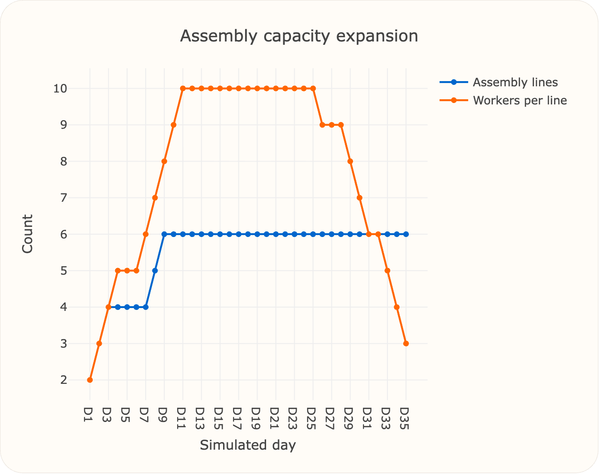
*Figure 1 — Number of assembly lines and workers per line across the 35-day run*

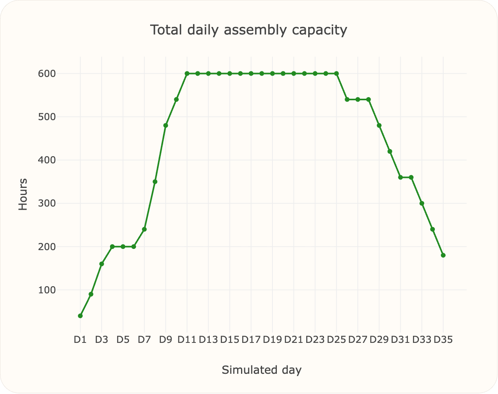
*Figure 2 — Total daily assembly hours (lines × workers × shift hours)*

The total capacity chart (Figure 2) shows the escalation effect: daily assembly hours grew from 40h (day 1) to 600h (days 11–25), a 15× increase driven by both adding lines and adding workers per line simultaneously. This compounding meant capacity grew much faster than either lever alone would have produced.

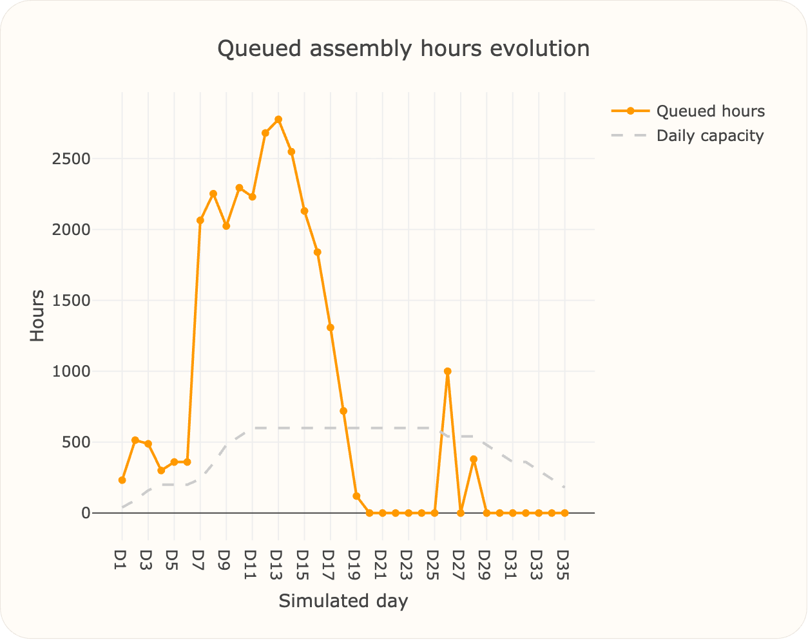
*Figure 3 — Hours of work queued at the assembly stage each day*

The queued hours chart (Figure 3) shows the factory was under sustained load until day 13 (the end of Black Friday) after which the queue drained steadily, reaching zero by day 20.

**What the agent is bad at:** The clearest failure was not closing assembly lines after demand collapsed on day 26, the agent only reduced workers per line (from 10 down to 3 by day 35), leaving all 6 lines open and paying fixed costs throughout. It did correctly stop releasing new production orders from day 26 onwards (the retailer already had 493+ printers against ~10 orders/day) and fulfilled 100% of customer orders through to day 35, but the idle assembly lines kept burning fixed costs with no output.

**Skill rewrites:** Two bugs were identified by watching the agent fail and one fix was kept.

- **Empty queue misread as "no capacity":** In an early calm-market run, the agent logged *"The assembly queue is empty (0.0h), so no production release is possible"* and released zero orders for multiple days despite 34+ PENDING sales orders and full stock. The reasoning was backwards: an empty queue means the factory is idle, not blocked. The fix added a **Step 0** block at the top of the decision framework ("Release PENDING orders first, every day, no exceptions") and three DO NOT rules: do not treat `0.0h queued` as a blocker, do not use `Needed = 0` as a reason to skip releasing, and do not treat the stock floor as a release gate.

- **Assembly line over-expansion:** In a Gemini-driven run, the agent opened 8 assembly lines despite `demand_modifier = 1.0` and zero backlog throughout, burning $13,600/day in fixed costs with no output (net loss −$859,397 at day 35). A stricter fix was drafted — a three-question gate before any `open-assembly-line` call, tighter scaling thresholds, and four additional DO NOT rules — but it was reverted before being tested, because the subsequent Claude/Haiku run stayed at 2 lines without it. The over-expansion appears to be a model-specific behaviour: Gemini ignored the existing `backlog_days` rule; Claude followed it.

---

### Provider Manager (`skills/provider-manager.md`)

The provider agent manages six raw material lines for ChipSupply Co. Its job each day is to restock products below 50% of their starting level, raise prices when stock is below 30% of starting, lower prices when stock is above 150%, and stay within a 15% daily price change bound. It receives the same market signal as the other agents and is expected to restock more aggressively when `demand_modifier > 1.5`.

**What the agent is good at:** the restocking decisions are straightforward, the starting stock targets are explicit in the skill, so the agent reliably ordered when stock dropped. Most importantly, the agent kept all component stocks topped up throughout the entire run, including during the chip shortage (days 14–20), so no material ever ran out. Because stock never fell below the 30% threshold that triggers a price increase, bulk prices correctly stayed flat: Control Board held at $25 for all 35 days, consistent with its rules.

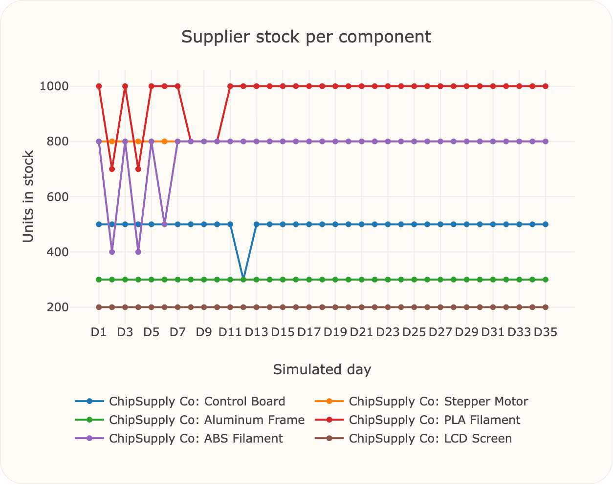

**What the agent is bad at:** Aluminum Frame and ABS Filament showed erratic price oscillations (roughly $22–$38 and $11–$24 respectively) that were not clearly tied to stock levels or scenario events, prices moved up and down without a sustained trend in either direction. This suggests the agent was reacting to small day-to-day stock fluctuations rather than following a consistent pricing strategy.

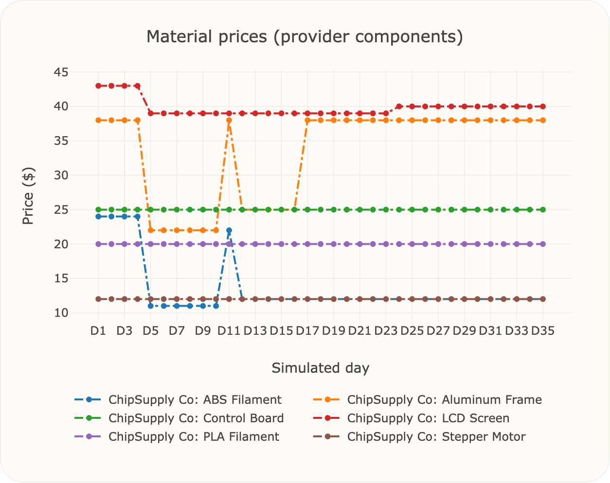

---

### Retail Manager (`skills/retail-manager.md`)

The retail agent manages PrinterWorld. Each day it fulfills or backorders pending customer orders, places replenishment orders with the manufacturer when stock drops below safety thresholds (Basic300: 30 units, Pro450: 15 units, Elite700: 5 units), and adjusts retail prices 5% up or down based on stock pressure and the active demand signal.

**What the agent is good at:** fulfillment and backordering logic was consistent and no customer orders were left in PENDING state at end of day. The safety stock floor kept replenishment orders arriving even during quieter periods. On Black Friday (days 11–13) the retailer fulfilled 82/96/104 orders per day while accumulating 63/59/62 backorders, but the proportion of fulfilled vs backordered was similar to the pre-surge baseline — the agent did not perform noticeably worse under 3× demand than it had during normal days.

**What the agent is bad at:** After day 26, when the post-holiday lull cut demand to ~10 orders/day, rather than cutting prices to clear inventory, the retailer's stock for Basic300 and Pro450 kept growing (reaching 840 units by day 35) while retail price fell only slowly from 4,614 to 3,057 — still well above what was needed to stimulate demand at the new lower level.

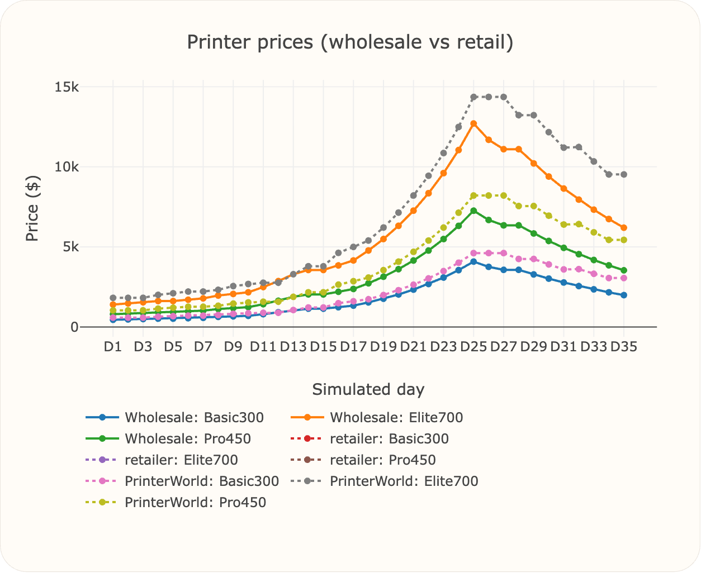
*Figure 4 — Basic300 wholesale and retail price per simulated day*

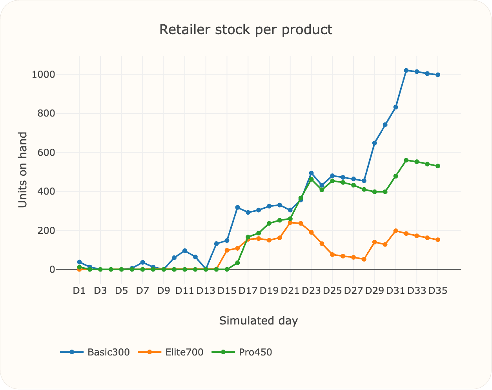
*Figure 5 — Retailer stock per printer model (Basic300 and Pro450)*

---

## c) Simulation Results

Two scenarios were run: **holiday-rush** (35 days, volatile) and **calm-market** (35 days, baseline).

### Scenario Definitions

| Event | Days | demand_modifier | supply_modifier | lead_time_modifier |
|---|---|---|---|---|
| Normal | 1–10 | 1.0 | 1.0 | 1.0 |
| Black Friday | 11–13 | 3.0 | 1.0 | 1.0 |
| Chip shortage | 14–20 | 1.5 | 0.4 | 2.0 |
| Christmas rush | 18–25 | 2.5 | 0.6 | 1.2 |
| Post-holiday lull | 26–35 | 0.5 | 1.0 | 1.0 |
| **Calm market** | **1–20** | **1.0** | **1.0** | **1.0** |

Days 18–20 have both chip shortage and Christmas active simultaneously. The engine multiplies demand modifiers (1.5 × 2.5 → 3.75 effective demand) and takes the minimum supply modifier (0.4), producing the most stressed window of the entire run.

---

### Results & Interpretation

**Did the manufacturer build stock ahead of Black Friday?**

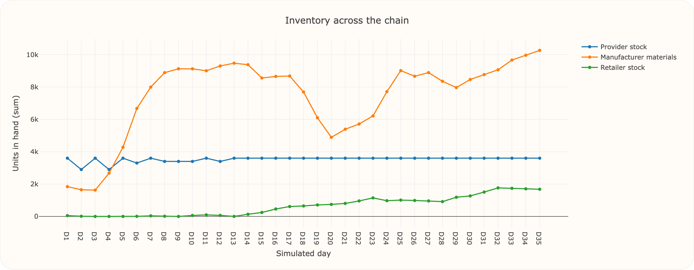
*Figure 6 — Total stock across all three tiers (chain-wide scale; individual printer counts are not readable here — see Figure 5)*

*Figure 5 (repeated at a readable scale)*

The retailer's printer stock rose from near zero on day 6 to 30 units on day 10 and 48 units on day 11, which is the first day of Black Friday. This build-up was driven by the manufacturer's production queue: active production orders grew from 7 on day 3 to 38 by day 10, showing the agent was releasing large batches well in advance. On the materials side, Control Board inventory climbed from 110 on day 2 to 1,742 by day 9, reflecting aggressive upstream ordering that the agent triggered because stock was below its floor. The manufacturer did not explicitly anticipate Black Friday (the market signal does not arrive in advance), but the proactive reordering rules in the skill produced the right behaviour anyway.

**When stockouts happened, whose decision was the proximate cause?**

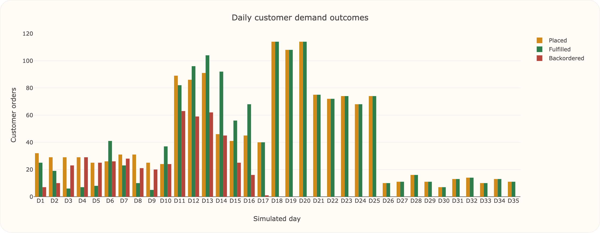

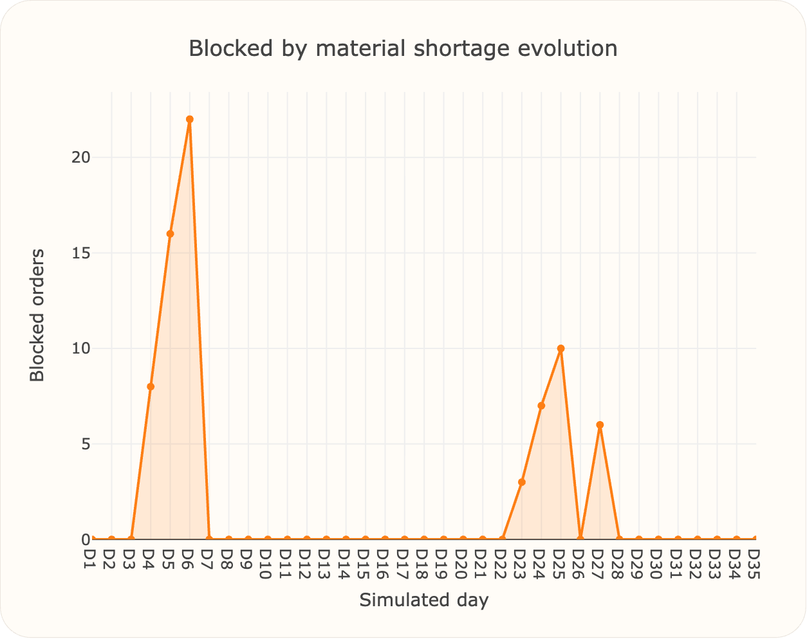

The stockout on days 3–6 (four consecutive days at zero retailer stock) was a throughput bottleneck at the manufacturer rather than a materials shortage. By day 3 the manufacturer had 545 Control Boards in inventory, so materials were not the constraint, but blocked orders grew from 8 on day 4 to 22 on day 6, meaning the assembly queue had more work than it could complete per turn. The retailer was placing ~25 orders per day but printers were not arriving because the production pipeline needed several days to catch up after the initial stock depletion. Recovery came on day 6 when 41 units were fulfilled (clearing accumulated backorders), suggesting the manufacturer's queued production orders finally cleared. The proximate cause was the retailer starting with only 25 units and immediately selling through them, with no same-day production possible.

| Day | Retailer stock | Orders placed | Fulfilled | Backordered | Blocked (mfr) |
|-----|---------------|---------------|-----------|-------------|----------------|
| 1   | 25            | 32            | 25        | 7           | 0              |
| 2   | 6             | 29            | 19        | 10          | 0              |
| 3   | 0             | 29            | 6         | 23          | 0              |
| 4   | 0             | 29            | 7         | 29          | 8              |
| 5   | 0             | 25            | 8         | 25          | 16             |
| 6   | 3             | 26            | 41        | 26          | 22             |

**Did prices stabilise or oscillate?**

*Figure 4 (repeated)*

Both wholesale and retail prices moved monotonically with only 3 direction changes across the entire run without any oscillation. Basic300 wholesale rose steadily from 450 on day 1 to 4,082 on day 25 (the Christmas rush peak), then fell gradually to 1,990 by day 35. The retail price lagged slightly behind: it stayed at 585 for three days while wholesale had already risen, and held at 4,614 for three extra days into the post-holiday lull before catching up. The only genuine price swing was in the provider's Control Board tier-1 price, which jumped from 55 to 220 on day 17 and back to 55 within three days — but this was the provider agent overcorrecting, and it did not cause the printer prices to oscillate because the manufacturer's pricing rules smooth out single-day input cost spikes.

| Day | Event | Basic300 wholesale | Basic300 retail | CB tier-1 |
|-----|-------|--------------------|-----------------|-----------|
| 1   | normal | 450 | 585 | 40 |
| 3   | normal | 496 | 585 | 55 |
| 10  | normal | 697 | 862 | 55 |
| 16  | chip shortage | 1,236 | 1,487 | 55 |
| 17  | chip shortage | 1,334 | 1,606 | **220** |
| 18  | chip + christmas | 1,535 | 1,735 | 110 |
| 20  | chip + christmas | 2,029 | 2,294 | 55 |
| 25  | christmas peak | **4,082** | **4,614** | 55 |
| 26  | post-holiday lull | 3,755 | 4,614 | 55 |
| 29  | post-holiday lull | 3,282 | 4,247 | 55 |
| 35  | post-holiday lull | 1,990 | 3,057 | 55 |

**Can you identify a bullwhip moment?**

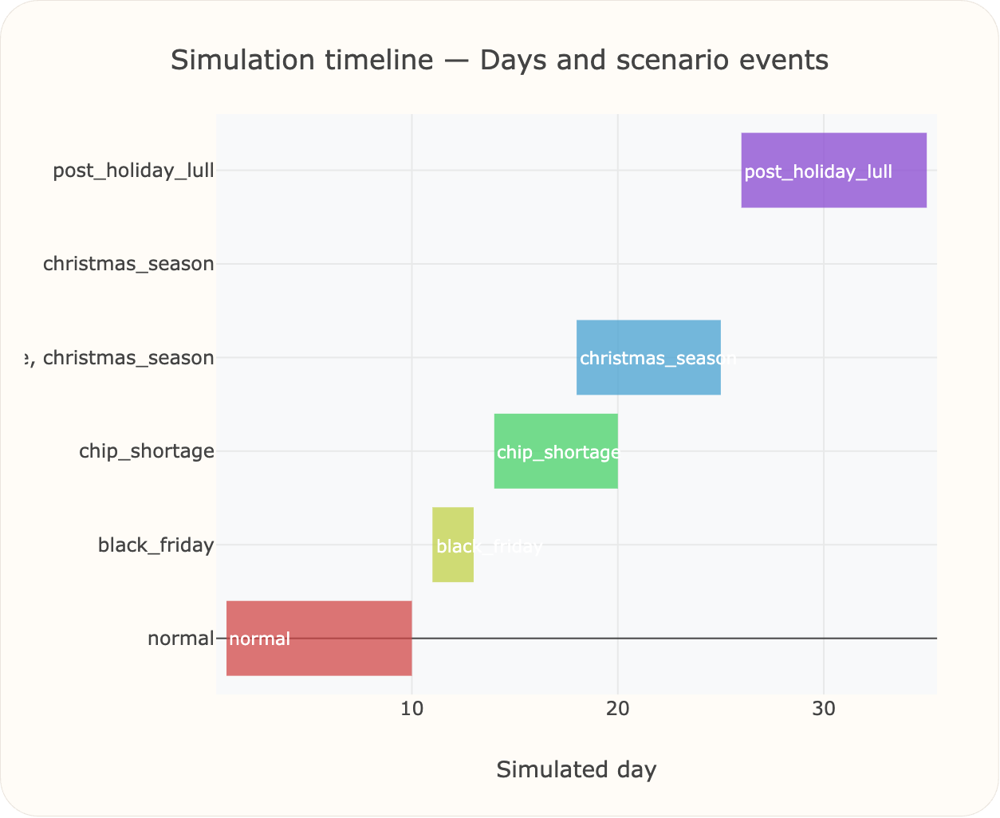
*Figure 7 — Active scenario events by day (demand and supply modifiers in effect)*

There is no bullwhip moment in this run. Looking at the actual manufacturer-to-provider purchase orders, the manufacturer's ordering was driven by its own internal stock floor targets rather than by retail demand signals. The largest upstream orders (2,500–2,800 units/day) happened during days 1–4 when retail demand was only ~29/day, because the manufacturer was building its initial stock buffer. During Black Friday (days 11–13) when retail orders tripled to ~89/day, manufacturer orders to the provider stayed flat at 2,100–2,300 not showing any amplification. During the Christmas rush (days 18–25), manufacturer orders actually declined to 600–1,800/day because it was drawing down existing inventory instead of ordering more. The post-holiday overstock (retailer stock growing from 493 to 840 units after day 26) showed a pipeline inertia, which means that printers already in production kept arriving after demand collapsed, not a bullwhip amplification across tiers.

**Financial performance**

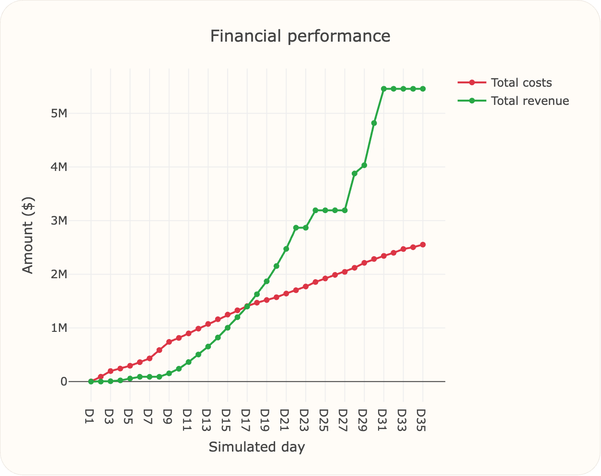

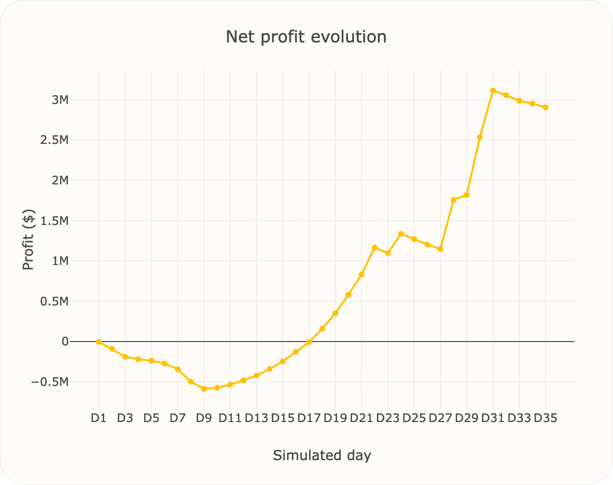

Costs increased in a very linear way throughout the run, as the fixed assembly line costs accrued every day regardless of output. Revenues, by contrast, were near zero until day 8, after which they grew steeply as finished printers started shipping to the retailer. The factory stopped running at a loss on day 17, when cumulative revenues finally surpassed cumulative costs. From day 31 onwards revenues stabilised as the post-holiday lull reduced demand and the manufacturer's production effectively stopped.

---

### Scenario Comparison between Holiday Rush Scenario and Calm Market Scenario

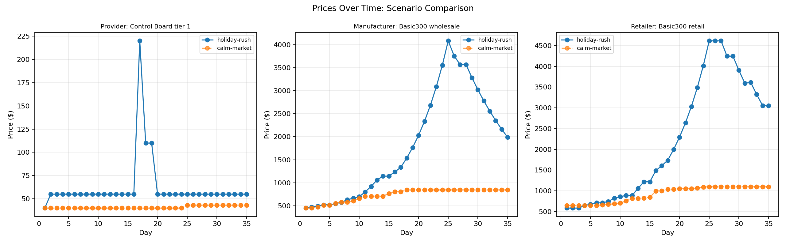

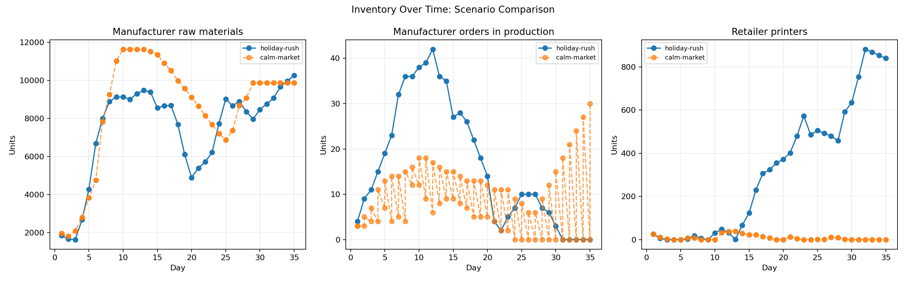

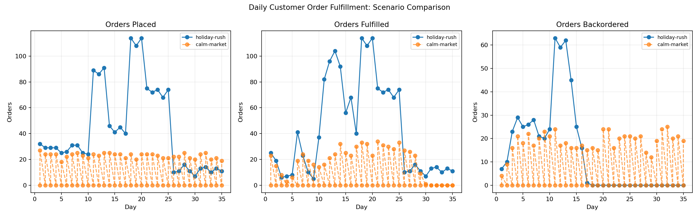

| | Holiday-rush | Calm-market |
|---|---|---|
| **Wholesale price range** | $450 → $4,082 → $1,990 (9× swing) | $450 → $844 (less than 2×) |
| **Assembly lines opened** | 2 (no additional lines) | 2 (no additional lines) |
| **Retailer stock peak** | 840 printers (day 35) | Near zero for most of the run |
| **Total backorders** | 484 | 646 |
| **End-state** | Massive overstock (84 days of supply) | Empty shelves with persistent backlogs |

- **Prices:** The holiday run produced a 9× wholesale price swing (450 → 4,082 → 1,990) driven by the demand surges. The calm run barely moved, peaking at 844 on day 20, less than double the starting price.
- **Buffer-building:** In the holiday run, demand spikes triggered proactive inventory build-up; the retailer reached 48 printers ahead of Black Friday and 840 by the end. In the calm run, the retailer's stock never recovered from the day 3–10 stockout and stayed near zero for most of the simulation.
- **Backorders:** Counterintuitively, the volatile run produced fewer total backorders (484 vs 646), because the agents responded better to change than to a flat steady-state signal — the demand spikes prompted action that the calm signal did not.
- **Assembly lines:** Neither scenario triggered the manufacturer to open more than 2 lines, suggesting the scaling thresholds were conservative enough that a 35-day holiday surge did not cross them.
- **Failure modes:** Opposite outcomes from the same agents — the holiday run ended in post-holiday overstock with no mechanism to clear it; the calm run ended in chronic understocking with no mechanism to build up. Both are failures of adaptation, just in opposite directions.

---

### Emergent Behaviour

The most surprising behaviour was "stress-induced perfect fulfillment" on days 18–20, the hardest window in the entire simulation. The chip shortage (supply_modifier = 0.4) and Christmas rush (demand_modifier up to 3.75 combined) overlapped simultaneously, yet those three days recorded 114/108/114 orders placed and 114/108/114 fulfilled: 100% fulfillment with zero backorders. Every other stressed period produced backorders. What happened is that the chip shortage had already forced the manufacturer to build up a large inventory buffer during days 14–17 (when demand was only 1.5×), and that buffer was exactly what the system needed when demand tripled. The agents did not plan this, they each followed their independent skill rules, but the timing of the two events created an accidental alignment between inventory peaks and demand peaks that neither a pure demand surge nor a pure supply shock would have produced alone.

A second emergent behaviour was model-dependent: the same skill file produced opposite outcomes depending on which LLM ran it. In the Gemini run on a calm-market scenario, the manufacturing agent opened 8 assembly lines despite zero backlog, zero demand surge, and no pending orders, burning $13,600/day with zero output and finishing at −$859,397 net loss. The Claude/Haiku run on the identical skill file stayed at 2 lines throughout. The instruction was ambiguous enough that Gemini misread it; Claude followed it correctly. This was not a bug in the skill file in any absolute sense, it was an emergent property of how different models interpret the same natural-language instruction differently, and the only way to discover it was to run the full simulation with each model.

---

## d) Vibe-Coding Reflection

### How we used Claude Code

Claude Code was used at different layers in Week 8: it wrote the turn engine scaffolding, generated the initial skill files, and was then used iteratively to refine those skills as failure modes appeared in logs. Week 8 prompts were observation-driven ("the agent wrote this in the log, why is it wrong and how do we fix the skill?"). Claude Code was also used to generate graphs from `metrics.jsonl`.

### What worked

The same pattern that worked in Week 6 held in Week 8: precise, file-scoped prompts with explicit PRD section references produced correct code on the first attempt. Asking Claude Code to implement a named function in a named file, with numbered acceptance criteria, eliminated most ambiguity. 

The skill files themselves benefited from an iterative loop: run one day in isolation, read the log, identify a bad decision, tighten the skill, repeat. 

### What did not work

Skill ambiguities cannot be caught by reading the file — they only surface when the simulation runs and the agent logs its own reasoning. The clearest example was the "empty queue means no capacity" misreading: the manufacturing skill said to check the queue before releasing orders, which looks correct on paper, but the agent read an empty queue as "nothing to produce" rather than "the factory is idle, release now." This caused it to sit idle on days 6 and 8 with pending orders it could have filled. A related gap was the missing downscaling rule: the skill had clear instructions for opening assembly lines but none for closing them, so the agent kept paying fixed line costs through the final days of the run despite producing nothing and the retailer already holding 840 printers in stock.

### The one thing we would redesign

The sequential turn order (provider, then manufacturer, then retailer) is the single design decision we would change. Each agent acts on yesterday's state and can never react to the same-day decisions of the agents that went before it: the manufacturer ships to the retailer before the retailer has placed that day's demand, and the provider confirms delivery before the manufacturer has processed it. This lag is what produced the days 3–6 stockout cascade: even though the manufacturer had stock on day 3, the retailer's replenishment order placed on day 2 could not be fulfilled until the next turn. A synchronous round model, where all three agents propose actions, then a resolver applies them in a single atomic step, would eliminate the one-day propagation delay and more accurately reflect how a real supply chain negotiates the same business day.
