# Week 5 Report
# 3D Printer Production Simulator - Manufacturer App

## Team

- Pol Plana
- Alba Roma
- Emma Nájera

## 1. Design Decisions

### 1.1 Data model

Our simulator follows the entity structure proposed in the course brief, but adapts it to the actual repository implementation. The main persisted entities are `Product`, `BillOfMaterials`, `Supplier`, `Inventory`, `ManufacturingOrder`, `PurchaseOrder`, `Event`, and `SimulationConfig`. This structure gave us a clear separation between master data and operational data. Products, BOMs, suppliers, and configuration define the factory itself, while inventory, orders, purchase orders, and events describe the changing state of the simulation.

Two small additions became especially useful during implementation. First, manufacturing orders and purchase orders both include `reference_code` fields, which made the UI and event log much easier to read than raw UUIDs. Second, both also include `status_reason`, which let us explain why an order was blocked or rejected without building a much more complex state model.

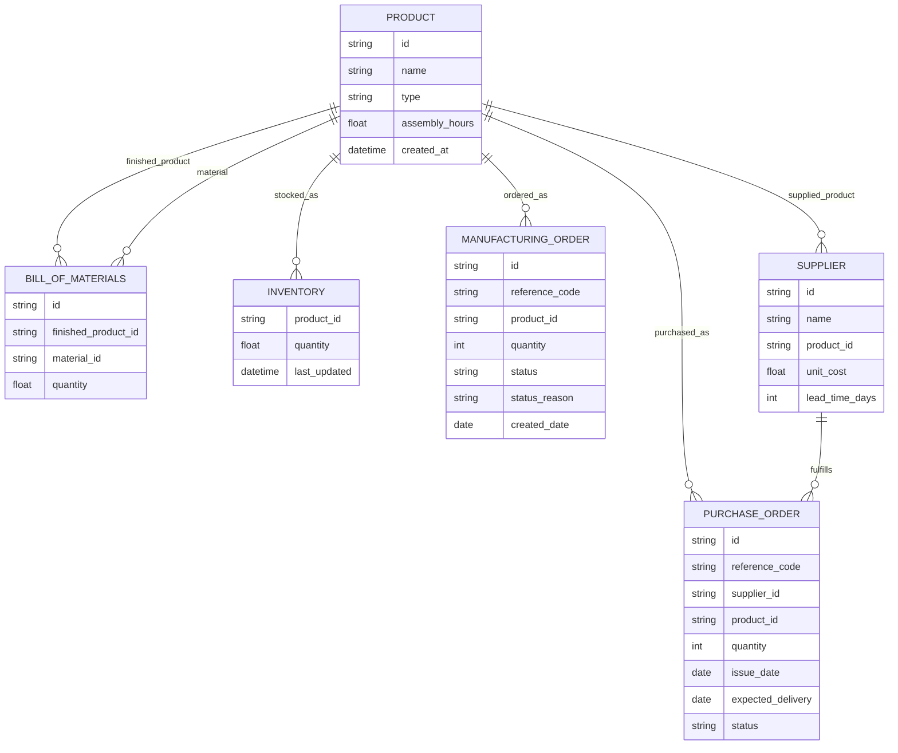

### 1.2 Architecture choices

The final Week 5 architecture is a FastAPI backend with SQLAlchemy and SQLite,
plus a React + Vite frontend. In the current repository these live under
`manufacturer/backend/` and `manufacturer/frontend/`. This differs from the
original course suggestion, which proposed Streamlit for the UI and
recommended SimPy for the simulation engine.

We initially started in the Streamlit direction, but the generated software
was harder to turn into a clean planner interface. Codex suggested trying a
React + Vite frontend, and we tested that option while the cost of switching
was still low. After comparing the results, we agreed that React gave us a
clearer interface structure, better routing between workflows, and stronger
separation between frontend and backend responsibilities.

We also chose not to use SimPy. Instead, we implemented our own day-by-day
simulation flow in backend services. This was a deliberate trade-off: SimPy
would have given us a proven simulation library, but the project mostly works
as a turn-based planner where the user clicks "Advance Day". A custom service
flow was easier for us to inspect, test, and connect to the REST API.

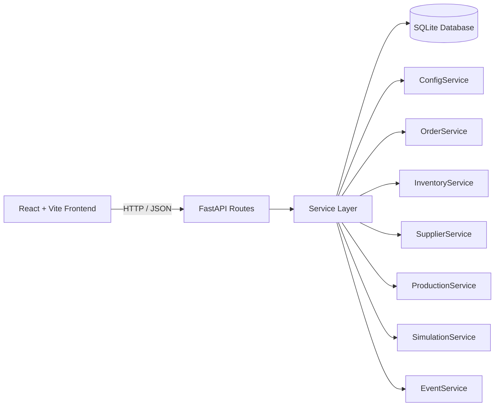

### 1.3 API and UI interaction

The project is API-first. The React frontend calls the FastAPI backend for
the main reads and operations: configuration, materials, BOM management,
suppliers, purchase orders, manufacturing orders, simulation status, event
history, and full-state JSON export/import. The Settings page exposes the
restore flow, where a previously exported snapshot can be loaded back into
the simulator.

Keeping the business logic in the backend helped us avoid duplicating rules
in the frontend. For example, material shortages, blocked orders, purchase
order arrivals, warehouse-capacity checks, and event logging are handled by
backend services and then displayed by the UI.

### 1.4 Trade-offs discussed as a team

- React gave us a more capable UI than the original Streamlit direction, but it also made the frontend stack more complex.
- A custom simulation engine gave us more control and made the logic easier
  to inspect, but it required more direct validation from us than a dedicated
  framework would.
- SQLite was a good fit for simplicity and portability, even though it is a
  local-project choice rather than a production-scale database choice.
- Full-state export and restore are useful for comparing scenarios, but they
  also required careful validation because the imported snapshot has to
  rebuild the simulator consistently across configuration, master data,
  inventory, orders, and event history.

## 2. The PRD Process

### 2.1 How we used AI to build the PRD

We began from the course brief and used Claude Code to help draft the initial PRD. The PRD-first approach was useful because it gave the coding agent a shared reference point instead of forcing it to infer the whole architecture from disconnected prompts.

The first implementation prompt, where we referenced the PRD, was especially surprising to us because it led to a lot of observable work as output. That experience made it clear that giving the model strong project context early was important.

Later, after switching tools, we kept using the same PRD-first idea with Codex. In practice, that meant grounding the agent in the current repository, the intended architecture, and the milestone we were trying to complete before asking it to implement or review anything.

We also kept a Markdown-based project memory and milestone tracker. That
document was important because it recorded what had already been done, what
was still pending, and what the next implementation step should be. This made
the work easier to continue across different sessions and different coding
tools.

### 2.2 Tooling problems and why we switched tools

At the beginning we had problems deciding which coding tool to use. The Week
5 statement asked us to use Claude Code, so we started there with the
provided course setup. After the initial class work, plan and access
restrictions made it difficult to continue with only that setup. We therefore
used Claude Code and Codex at different moments of the project, depending on
what was available and practical for the team.

The important part is that the workflow did not reset every time the tool
changed. We kept using the PRD, `CLAUDE.md`, and the Markdown milestone
tracker as shared context. In general, Codex gave us better results once the
repository had a clearer structure and the prompts referenced the PRD,
current files, and expected behavior.

### 2.3 What we changed from the initial AI suggestions

We did not accept the first AI-generated direction blindly. The most important
changes were:

- We moved from the original Streamlit prototype direction to React + Vite
  because the interface quality and workflow separation were better.
- We chose a custom turn-based simulation flow instead of SimPy because the
  "Advance Day" interaction was simple enough to model directly.
- We kept the backend responsible for business rules instead of letting the
  frontend calculate production, shortages, or arrivals.
- We added readable reference codes and status explanations because they made
  the dashboard and event history easier to understand.

### 2.4 Prompting observations

We tried different prompt styles during the project. We experimented with structured prompts, less structured prompts, longer prompts, shorter prompts, and prompts that were intentionally vague just to observe how much difference prompting quality made.

Our main conclusion was that structured, direct, and context-rich prompts worked best. When we clearly referenced the PRD, the current codebase context, and the expected outcome, the results were much more reliable. Less structured prompts sometimes still produced good results, but they were inconsistent and sometimes did not solve the actual issue.

We also used Codex in an analysis mode. In some moments we asked it to inspect the current implementation for bugs or weak points without applying any fix yet. After reviewing those results ourselves, we followed up with a second, much more structured prompt to implement the fixes we agreed were necessary.

#### Example of a good prompt

> Read `CLAUDE.md` and `docs/PRD2.md`, inspect the current FastAPI routes and the React pages related to manufacturing orders, then fix the blocked-order workflow so that orders blocked by missing materials can automatically return to the released queue once inventory becomes available. Do not change unrelated UI copy. Run the relevant tests after the change.

This type of prompt worked well because it gave context, scope, intended behavior, and a verification step.

#### Example of a weak prompt

> Fix the simulator because some things are wrong in orders and inventory.

This type of prompt was much less reliable because it did not define the problem clearly, did not constrain the scope, and did not explain what success should look like. In particular, when we ran this prompt, the agent made some changes to the order status logic that were not aligned with our intended design and that caused more issues than they solved, so we had to revert the changes.

## 3. Screenshots and Functionality Evidence

The screenshots below follow the Week 5 deliverable: dashboard, complete day
cycle, and Swagger/OpenAPI.

### 3.1 Dashboard overview

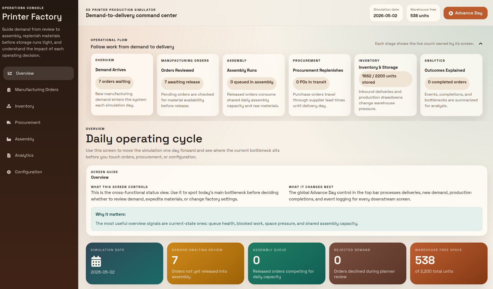{ width=95% }

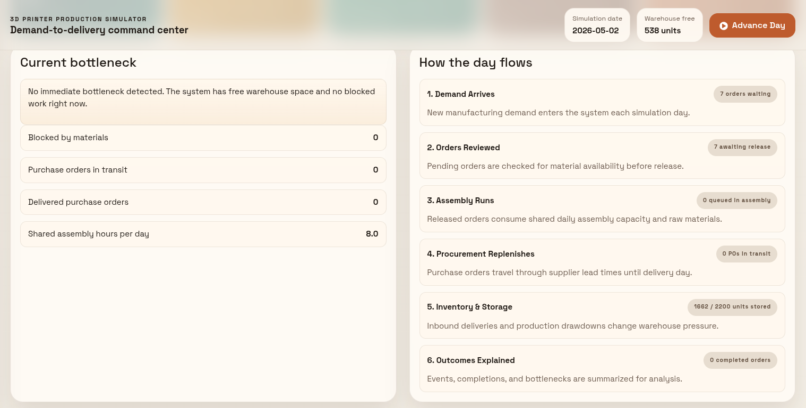{ width=95% }

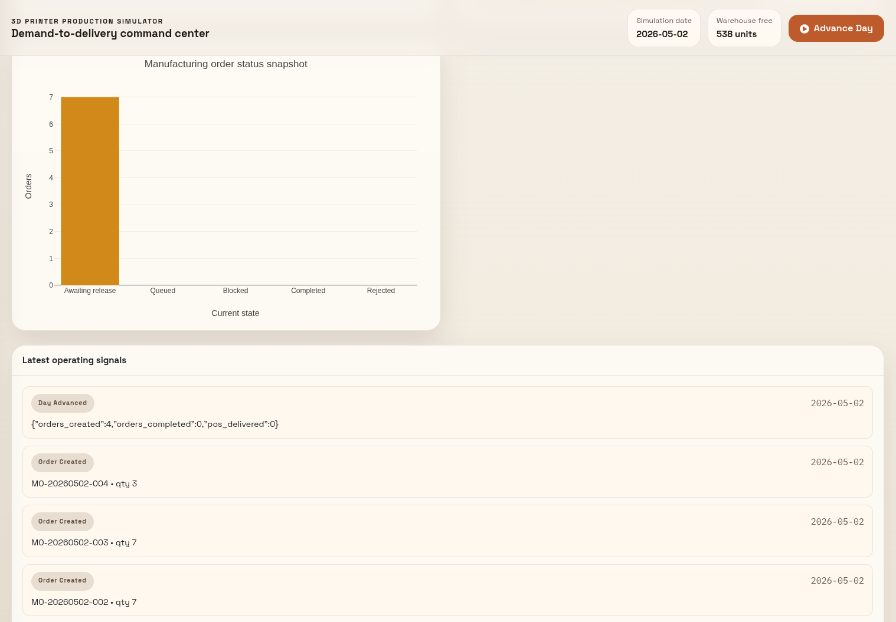{ width=95% }

### 3.2 Manufacturing orders and BOM decision

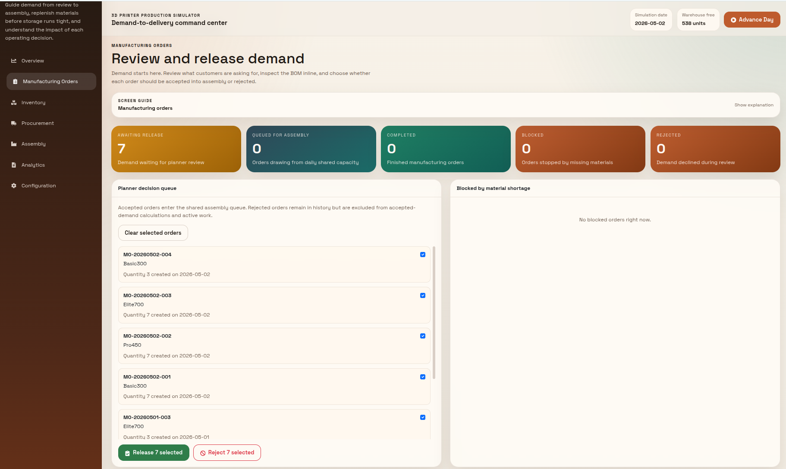{ width=95% }

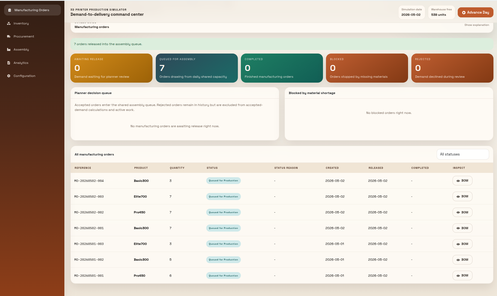{ width=95% }

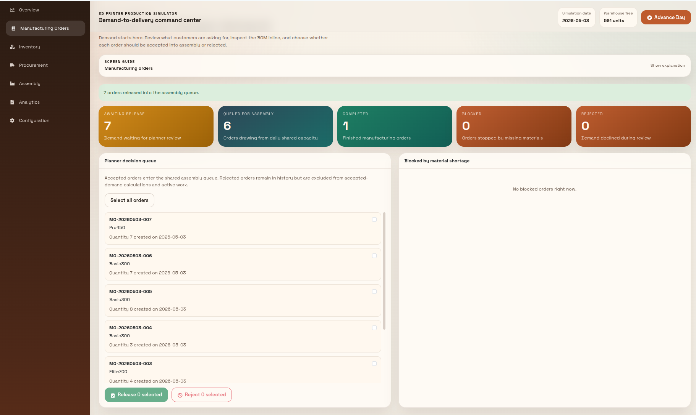{ width=95% }

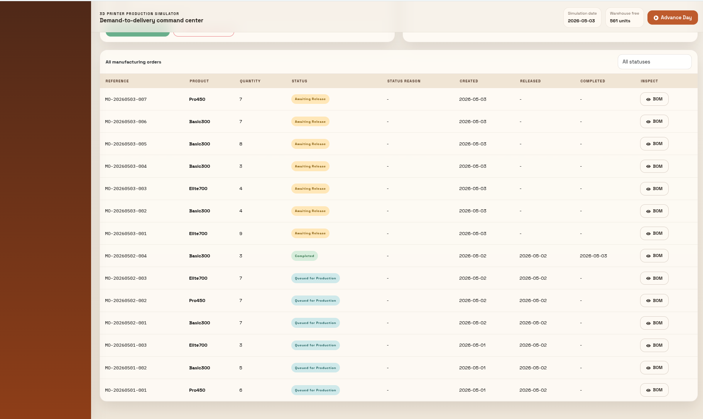{ width=95% }

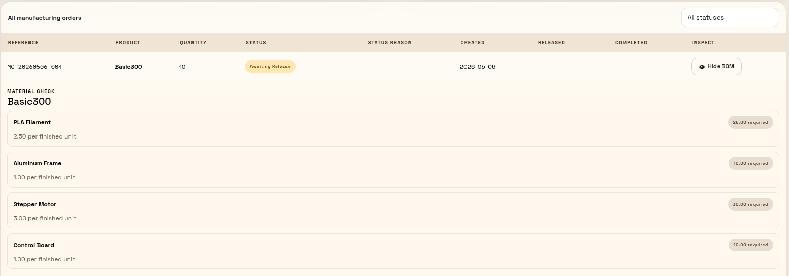{ width=95% }

### 3.3 Purchase order and inventory impact

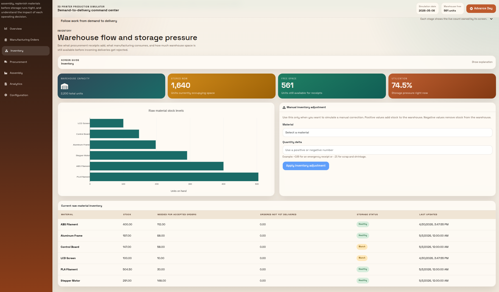{ width=95% }

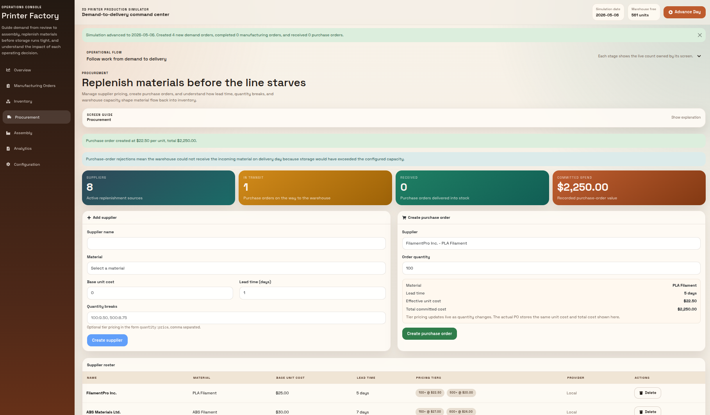{ width=95% }

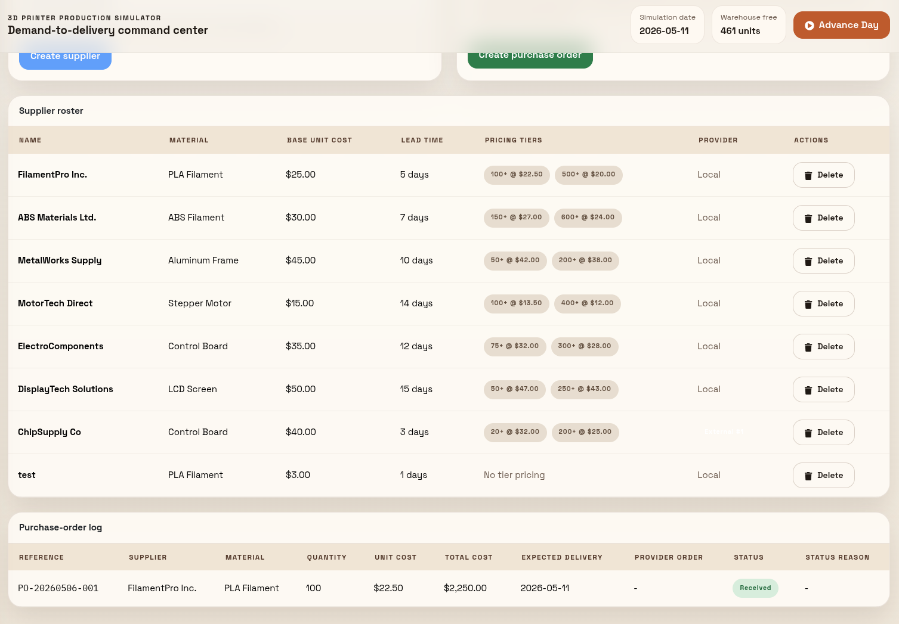{ width=95% }

### 3.4 Swagger / OpenAPI

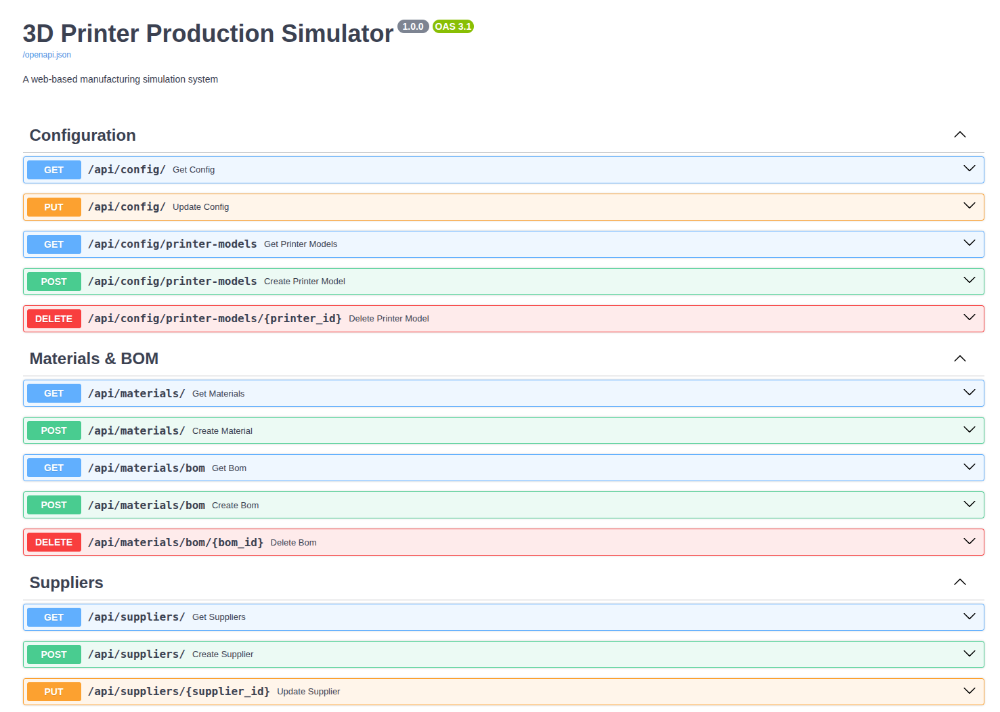{ width=95% }

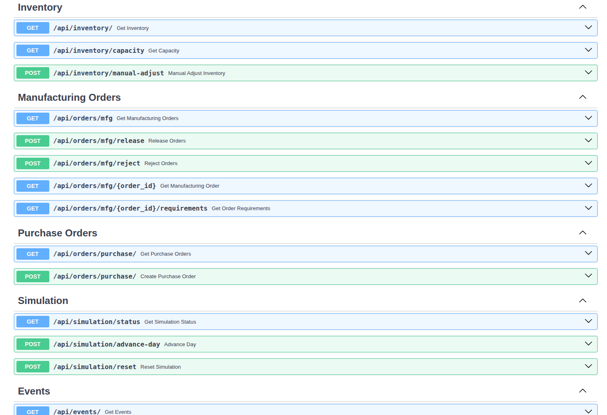{ width=95% }

## 4. Test Scenario Analysis

For the final report, we used a five-day scenario based on the example from
the course brief: demand appears, the planner releases only the work that can
be supported by inventory, a purchase order is created when stock is low, and
the delivery arrives after the supplier lead time.

Because demand generation can be random, the exact quantities in the
screenshots may differ from one run to another. The behavior we wanted to
show was the same: demand creates pressure, inventory limits production,
procurement has a delay, and the event log records the history.

### 4.1 Scenario setup

- Starting point: seeded Week 5 manufacturer data.
- Planner goal: complete as many manufacturing orders as possible without
  exceeding material availability or warehouse capacity.
- Main constraint: raw materials are consumed through the BOM, and purchase
  orders only arrive after their configured lead time.
- Evidence to capture: dashboard state, pending/released/blocked orders,
  inventory levels, purchase order status, and event log entries.

### 4.2 Day-by-day decisions

| Day | Planner decision | Result to discuss in the report |
| --- | --- | --- |
| 1 | Review new demand and release the order that inventory can support. | Materials are consumed according to the BOM, production completes if capacity is available, and events are logged. |
| 2 | Review new demand, identify the material that is becoming scarce, and issue a purchase order. | The purchase order appears as pending inbound stock with an expected delivery date. |
| 3 | Advance the simulation and keep blocked orders visible instead of hiding them. | Orders that cannot be produced stay blocked with a clear reason. |
| 4 | Advance again and inspect the event history and reports. | The system shows the waiting period caused by supplier lead time. |
| 5 | Receive the purchase order and recheck production. | Inventory increases, blocked orders can return to the released queue, and production can resume if capacity allows it. |

### 4.3 Charts and observations

The most useful chart for this scenario is inventory over time, because it
shows the drop caused by production and the jump when purchased materials
arrive. A completed-orders chart is also useful because it shows that
production is not limited only by demand: it also depends on material
availability and daily assembly capacity.

The event log is important because it explains why the chart changes. For
example, a stock increase should correspond to a `PO_DELIVERED` event, and a
flat production period should correspond to a material shortage or capacity
limit.

## 5. Vibe Coding Reflection

### 5.1 Team workflow

We worked together during class hours and also met outside class at the university. Some work was also divided before leaving class so that we could continue parts of the implementation as homework.

The workflow improved during the project. At the beginning, our commits were
less consistent because we were still discovering the architecture and the
right tool setup. As the project advanced, we became more disciplined about
working from milestones, keeping Markdown project memory updated, and making
commits that represented more stable pieces of work. By Week 6 the commit
messages were also more clearly connected to milestones and issues, which
made the history easier to understand.

### 5.2 What the coding agents did well

The strongest point was speed when the task was well framed. Once we provided the right context and a concrete objective, the agents were able to generate meaningful implementation work, inspect the repository, suggest architectural directions, and help us identify bugs or incomplete areas.

We especially noticed better results when the agent had a PRD or a clear project summary available. The more grounded the conversation was in the actual repository state, the more useful the results became.

### 5.3 Where the coding agents struggled

The weaker results usually appeared when the prompt was too vague or when the
tool did not have enough context to understand the intended architecture. We
also saw that early-generated directions were not always a good fit for the
project, especially around the original Streamlit path, which is one of the
reasons we changed the frontend direction early.

Another difficulty was continuity across tool changes. Claude Code and Codex
do not share the same conversation history, so the Markdown project memory
and milestone tracker became important. Without those documents, every new
session would have required more explanation and would have increased the
risk of the agent changing direction.

### 5.4 What we would do differently next time

We would standardize our prompting style earlier and keep the project memory
documents aligned with the real implementation at all times. We would also
create smaller issues from the beginning and make every commit reference the
issue or milestone it belongs to. This became more natural later in the
project, but it would have helped us even more if we had done it from the
first day.

### 5.5 Did the PRD-first approach help?

Yes. The PRD-first approach helped because it gave the project a stable
shared reference point. Without it, it would have been easier for the coding
agent to generate disconnected solutions across sessions. With the PRD in
place, the work was more coherent, and it was easier to compare what had been
planned, what had changed, and what still remained unfinished.

The PRD was also useful as a discussion tool for the team. We did not follow
it blindly, but when we changed direction, such as replacing Streamlit with
React or choosing not to use SimPy, the PRD made those changes visible and
easier to justify.
