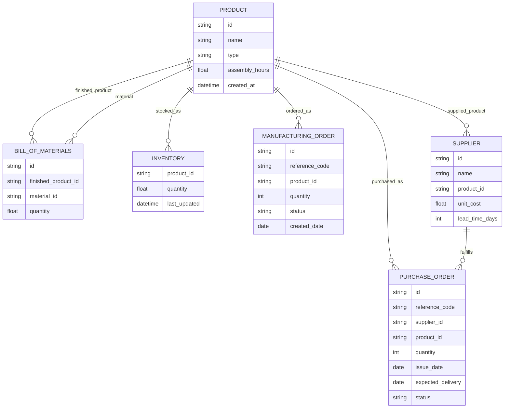
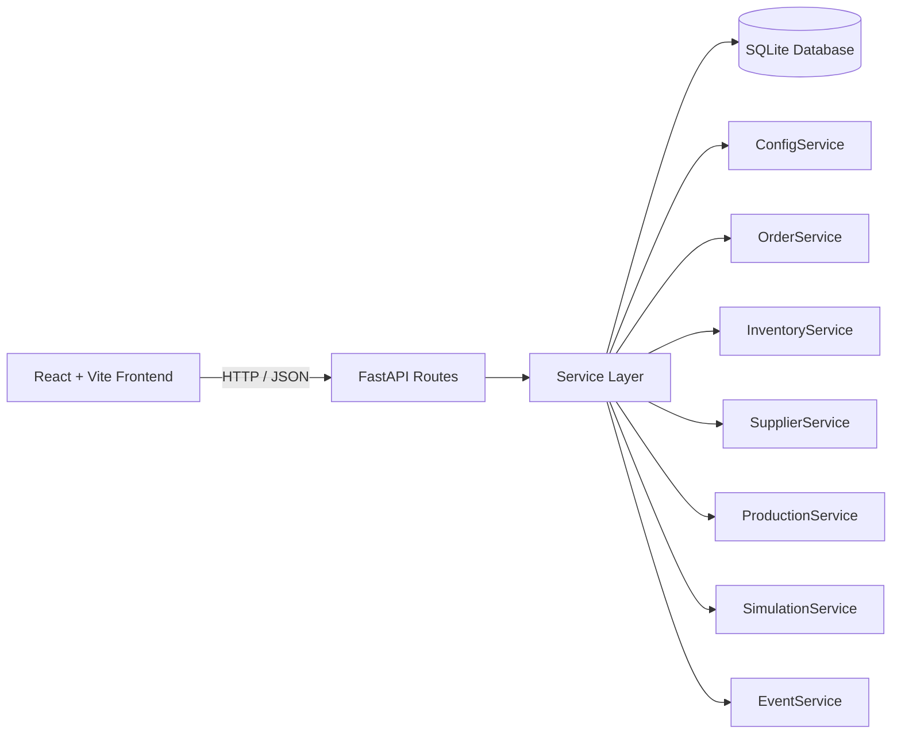

# Week 5 Report
# 3D Printer Production Simulator

## Team

- Pol Plana
- Alba Roma
- Emma Nájera

## 1. Design Decisions

### 1.1 Data model

Our simulator follows the entity structure proposed in the course brief, but adapts it to the actual repository implementation. The main persisted entities are `Product`, `BillOfMaterials`, `Supplier`, `Inventory`, `ManufacturingOrder`, `PurchaseOrder`, `Event`, and `SimulationConfig`. This structure gave us a clear separation between master data and operational data. Products, BOMs, suppliers, and configuration define the factory itself, while inventory, orders, purchase orders, and events describe the changing state of the simulation.

Two small additions became especially useful during implementation. First, manufacturing orders and purchase orders both include `reference_code` fields, which made the UI and event log much easier to read than raw UUIDs. Second, both also include `status_reason`, which let us explain why an order was blocked or rejected without building a much more complex state model.

### 1.2 Architecture choices

The final architecture is a FastAPI backend with SQLAlchemy and SQLite, plus a React + Vite frontend. This differs from the original course suggestion, which proposed Streamlit for the UI and recommended SimPy for the simulation engine.

We initially started in the Streamlit direction, but the generated software was having issues there. Codex proposed trying a different stack, and we decided to test React + Vite early in the project. After seeing the results, we agreed that it was a better option and updated the stack while the cost of switching was still low. That decision gave us a clearer interface structure and a stronger separation between frontend and backend concerns.

We also chose not to use SimPy. Instead, we implemented our own simulation engine through backend services that advance the state day by day. We made that choice deliberately because we wanted to experiment with the AI capabilities more directly. Rather than relying on a separate simulation framework, we wanted to see how far the coding agent could go in helping us define and implement the simulation rules ourselves.

### 1.3 API and UI interaction

The project is API-first. The React frontend calls the FastAPI backend for all main operations and data reads. This includes configuration, materials, BOM management, suppliers, purchase orders, manufacturing orders, simulation status, event history, and full-state JSON export and import. The Settings page exposes the restore flow, where a previously exported snapshot can be loaded back into the simulator. Keeping the business logic in the backend made the simulation easier to reason about and avoided duplicating logic across the interface.

### 1.4 Trade-offs discussed as a team

- React gave us a more capable UI than the original Streamlit direction, but it also made the frontend stack more complex.
- A custom simulation engine gave us more control and a better AI experimentation surface, but it required more direct validation from us than a dedicated framework would.
- SQLite was a good fit for simplicity and portability, even though it is clearly a local-project choice rather than a production-scale database choice.
- Full-state export and restore are useful for comparing scenarios, but they also required careful validation because the imported snapshot has to rebuild the simulator consistently across configuration, master data, inventory, orders, and event history.

## 2. The PRD Process

### 2.1 How we used AI to build the PRD

We began from the course brief and used Claude Code to help draft the initial PRD. The PRD-first approach was useful because it gave the coding agent a shared reference point instead of forcing it to infer the whole architecture from disconnected prompts.

The first implementation prompt, where we referenced the PRD, was especially surprising to us because it led to a lot of observable work as output. That experience made it clear that giving the model strong project context early was important.

Later, after switching tools, we kept using the same PRD-first idea with Codex. In practice, that meant grounding the agent in the current repository, the intended architecture, and the milestone we were trying to complete before asking it to implement or review anything.

### 2.2 Why we switched from Claude Code to Codex

We started with the teacher's provided API key, using Claude Code with Qwen through the provided setup. After the class session, that option was no longer available. We then tried registering for Qwen ourselves to continue with our own API key using the free tier, but we exhausted the available free resources almost immediately.

At that point we needed an alternative. One member of the team had a Codex subscription, and Codex was also available through the free ChatGPT tier with GPT-5.4. We agreed to switch to Codex, and from that point onward we observed a clear improvement in the quality of the results and in how much progress we could make from a prompt.

### 2.3 What we changed from the initial AI suggestions

[Leave space here for concrete examples of suggestions that were changed, rejected, or refined.]

### 2.4 Prompting observations

We tried different prompt styles during the project. We experimented with structured prompts, less structured prompts, longer prompts, shorter prompts, and prompts that were intentionally vague just to observe how much difference prompting quality made.

Our main conclusion was that structured, direct, and context-rich prompts worked best. When we clearly referenced the PRD, the current codebase context, and the expected outcome, the results were much more reliable. Less structured prompts sometimes still produced good results, but they were inconsistent and sometimes did not solve the actual issue.

We also used Codex in an analysis mode. In some moments we asked it to inspect the current implementation for bugs or weak points without applying any fix yet. After reviewing those results ourselves, we followed up with a second, much more structured prompt to implement the fixes we agreed were necessary.

#### Example of a good prompt

> Read `CLAUDE.md` and `PRD.md`, inspect the current FastAPI routes and the React pages related to manufacturing orders, then fix the blocked-order workflow so that orders blocked by missing materials can automatically return to the released queue once inventory becomes available. Do not change unrelated UI copy. Run the relevant tests after the change.

This type of prompt worked well because it gave context, scope, intended behavior, and a verification step.

#### Example of a weak prompt

> Fix the simulator because some things are wrong in orders and inventory.

This type of prompt was much less reliable because it did not define the problem clearly, did not constrain the scope, and did not explain what success should look like. In particular, when we ran this prompt, the agent made some changes to the order status logic that were not aligned with our intended design and that caused more issues than they solved, so we had to revert the changes.

## 3. Screenshots

### 3.1 Dashboard

[Main dashboard]

### 3.2 Complete day cycle

[Sequence showing: advance day, make planner decisions, and observe the resulting state]

### 3.3 Swagger / OpenAPI

[FastAPI Swagger documentation page]

## 4. Test Scenario Analysis

[5-day scenario analysis]

### 4.1 Scenario setup

[Scenario explanation scenario]

### 4.2 Day-by-day decisions

[Planner decisions and results for each simulated day]

### 4.3 Charts and observations

[Explanation of relevant charts]

## 5. Vibe Coding Reflection

### 5.1 Team workflow

We worked together during class hours and also met outside class at the university. Some work was also divided before leaving class so that we could continue parts of the implementation as homework.

### 5.2 What the coding agents did well

The strongest point was speed when the task was well framed. Once we provided the right context and a concrete objective, the agents were able to generate meaningful implementation work, inspect the repository, suggest architectural directions, and help us identify bugs or incomplete areas.

We especially noticed better results when the agent had a PRD or a clear project summary available. The more grounded the conversation was in the actual repository state, the more useful the results became.

### 5.3 Where the coding agents struggled

The weaker results usually appeared when the prompt was too vague or when the tool did not have enough context to understand the intended architecture. We also saw that early-generated directions were not always a good fit for the project, especially around the original Streamlit path, which is one of the reasons we changed the frontend direction early.

### 5.4 What we would do differently next time

We would standardize our prompting style earlier and keep the project memory documents aligned with the real implementation at all times. We would also try to formalize milestone tracking more consistently so that any team member could resume work with the AI agent under the same context.

### 5.5 Did the PRD-first approach help?

Yes. The PRD-first approach helped because it gave the project a stable shared reference point. Without it, it would have been easier for the coding agent to generate disconnected solutions across sessions. With the PRD in place, the work was more coherent, and it was easier to compare what had been planned, what had changed, and what still remained unfinished.
